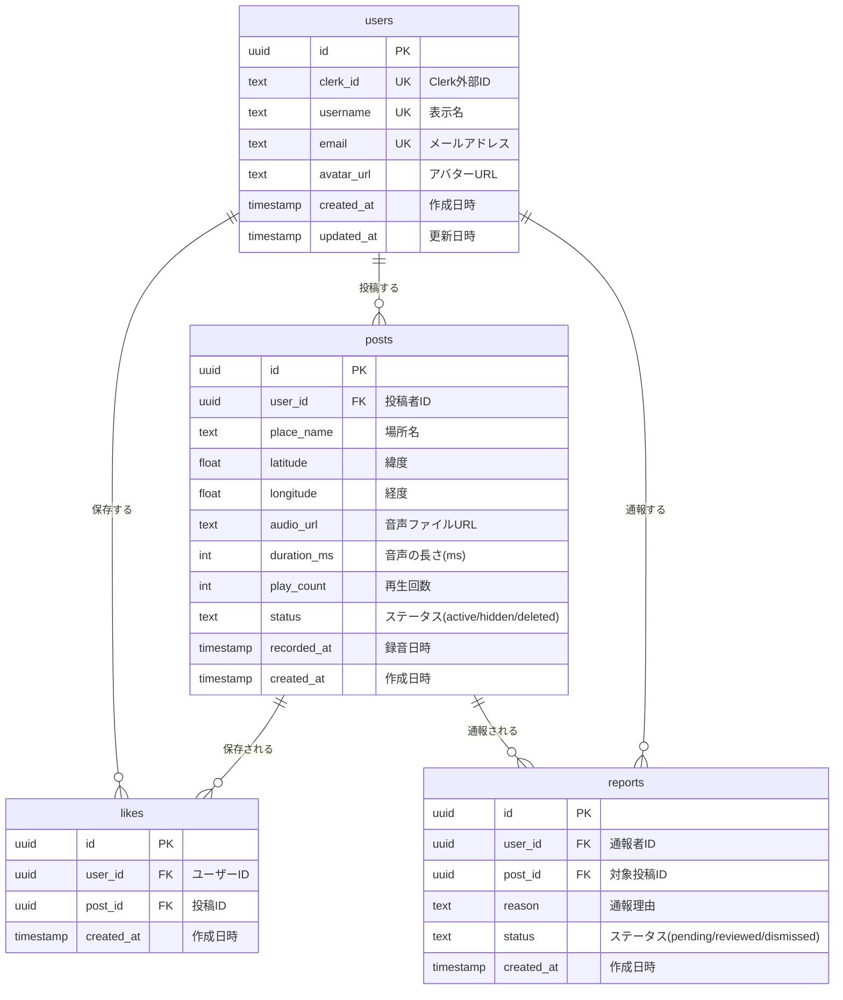

# データベース設計書 — SoundMap

## 1. 概要

SoundMap のデータベースは **Supabase（PostgreSQL）** を使用する。全テーブルに **Row Level Security（RLS）** を適用し、認証状態に応じたアクセス制御を行う。

### 設計方針

| 方針 | 詳細 |
|------|------|
| UUID 主キー | 全テーブルの主キーに `gen_random_uuid()` を使用。分散環境での衝突回避 |
| タイムスタンプ | `TIMESTAMPTZ`（タイムゾーン付き）を使用。UTC で格納 |
| 論理削除 | `status` カラムによる論理削除。物理削除は行わない |
| RLS 必須 | 全テーブルに RLS ポリシーを設定。Clerk JWT による認証情報で制御 |
| 外部キー制約 | リレーションシップの整合性を保証。`ON DELETE` の挙動を明示 |

---

## 2. ER図



---

## 3. テーブル定義

### 3.1 `users` テーブル

ユーザー情報を管理する。Clerk Webhook 経由で自動的にレコードが作成・更新される。

| カラム名 | データ型 | 制約 | デフォルト | 説明 |
|----------|----------|------|-----------|------|
| `id` | `UUID` | `PRIMARY KEY` | `gen_random_uuid()` | ユーザー ID |
| `clerk_id` | `TEXT` | `UNIQUE, NOT NULL` | — | Clerk のユーザー ID。外部認証との紐付けに使用 |
| `username` | `TEXT` | `UNIQUE, NOT NULL` | — | 表示名（3〜20 文字）。投稿者名として公開表示 |
| `email` | `TEXT` | `UNIQUE, NOT NULL` | — | メールアドレス。ログイン識別子 |
| `avatar_url` | `TEXT` | `NULLABLE` | `NULL` | アバター画像の URL。Clerk から同期 |
| `created_at` | `TIMESTAMPTZ` | `NOT NULL` | `now()` | レコード作成日時 |
| `updated_at` | `TIMESTAMPTZ` | `NOT NULL` | `now()` | レコード更新日時 |

**インデックス**:

| インデックス名 | カラム | 種別 | 用途 |
|---------------|--------|------|------|
| `users_clerk_id_key` | `clerk_id` | UNIQUE | Clerk Webhook でのユーザー検索 |
| `users_username_key` | `username` | UNIQUE | ユーザー名の一意性保証 |
| `users_email_key` | `email` | UNIQUE | メールアドレスの一意性保証 |

**RLS ポリシー**:

| ポリシー名 | 操作 | 条件 | 説明 |
|-----------|------|------|------|
| `users_select_all` | `SELECT` | `true` | 全ユーザーの `username`, `avatar_url` は誰でも閲覧可能 |
| `users_update_own` | `UPDATE` | `auth.uid() = clerk_id` | 自分のレコードのみ更新可能 |
| `users_insert_webhook` | `INSERT` | `service_role` | Clerk Webhook（サーバー側）からのみ挿入可能 |

---

### 3.2 `posts` テーブル

音声投稿のメタデータを管理する。音声ファイル本体は Supabase Storage に保存し、`audio_url` で参照する。

| カラム名 | データ型 | 制約 | デフォルト | 説明 |
|----------|----------|------|-----------|------|
| `id` | `UUID` | `PRIMARY KEY` | `gen_random_uuid()` | 投稿 ID |
| `user_id` | `UUID` | `FOREIGN KEY → users.id, NOT NULL` | — | 投稿者のユーザー ID |
| `place_name` | `TEXT` | `NOT NULL` | — | 場所名（1〜100 文字） |
| `latitude` | `DOUBLE PRECISION` | `NOT NULL` | — | 緯度（-90 〜 90） |
| `longitude` | `DOUBLE PRECISION` | `NOT NULL` | — | 経度（-180 〜 180） |
| `audio_url` | `TEXT` | `NOT NULL` | — | Supabase Storage のファイルパスまたは URL |
| `duration_ms` | `INTEGER` | `NOT NULL` | `30000` | 音声の長さ（ミリ秒）。最大 30,000ms |
| `play_count` | `INTEGER` | `NOT NULL` | `0` | 累計再生回数 |
| `status` | `TEXT` | `NOT NULL` | `'active'` | ステータス。`active` / `hidden` / `deleted` |
| `recorded_at` | `TIMESTAMPTZ` | `NOT NULL` | — | 録音日時 |
| `created_at` | `TIMESTAMPTZ` | `NOT NULL` | `now()` | 投稿日時 |

**外部キー制約**:

| 参照先 | ON DELETE | 説明 |
|--------|-----------|------|
| `users.id` | `CASCADE` | ユーザー削除時に関連投稿も削除 |

**インデックス**:

| インデックス名 | カラム | 種別 | 用途 |
|---------------|--------|------|------|
| `posts_user_id_idx` | `user_id` | B-tree | ユーザーごとの投稿検索 |
| `posts_location_idx` | `(latitude, longitude)` | B-tree | 地理空間クエリ（ビューポート内の投稿取得） |
| `posts_status_idx` | `status` | B-tree | アクティブな投稿のフィルタリング |
| `posts_created_at_idx` | `created_at` | B-tree | 投稿日時での並び替え |

**RLS ポリシー**:

| ポリシー名 | 操作 | 条件 | 説明 |
|-----------|------|------|------|
| `posts_select_active` | `SELECT` | `status = 'active'` | 全ユーザーがアクティブな投稿を閲覧可能 |
| `posts_insert_auth` | `INSERT` | `auth.uid() IS NOT NULL` | 認証済みユーザーのみ投稿可能 |
| `posts_update_own` | `UPDATE` | `auth.uid() = user_id` | 投稿者のみ自分の投稿を更新可能 |
| `posts_delete_own` | `DELETE` | `auth.uid() = user_id` | 投稿者のみ自分の投稿を削除可能 |

**CHECK 制約**:

```sql
CHECK (latitude >= -90 AND latitude <= 90)
CHECK (longitude >= -180 AND longitude <= 180)
CHECK (duration_ms > 0 AND duration_ms <= 30000)
CHECK (status IN ('active', 'hidden', 'deleted'))
```

---

### 3.3 `likes` テーブル（Phase 2）

ユーザーが気に入った音声を保存する機能。MVP では実装しない。

| カラム名 | データ型 | 制約 | デフォルト | 説明 |
|----------|----------|------|-----------|------|
| `id` | `UUID` | `PRIMARY KEY` | `gen_random_uuid()` | いいね ID |
| `user_id` | `UUID` | `FOREIGN KEY → users.id, NOT NULL` | — | いいねしたユーザー ID |
| `post_id` | `UUID` | `FOREIGN KEY → posts.id, NOT NULL` | — | いいねされた投稿 ID |
| `created_at` | `TIMESTAMPTZ` | `NOT NULL` | `now()` | いいね日時 |

**制約**:

| 制約名 | 種別 | カラム | 説明 |
|--------|------|--------|------|
| `likes_user_post_unique` | `UNIQUE` | `(user_id, post_id)` | 同じ投稿に対する重複いいねを防止 |

**外部キー制約**:

| 参照先 | ON DELETE | 説明 |
|--------|-----------|------|
| `users.id` | `CASCADE` | ユーザー削除時に関連いいねも削除 |
| `posts.id` | `CASCADE` | 投稿削除時に関連いいねも削除 |

**RLS ポリシー**:

| ポリシー名 | 操作 | 条件 | 説明 |
|-----------|------|------|------|
| `likes_select_own` | `SELECT` | `auth.uid() = user_id` | 自分のいいねのみ閲覧可能 |
| `likes_insert_auth` | `INSERT` | `auth.uid() IS NOT NULL` | 認証済みユーザーのみいいね可能 |
| `likes_delete_own` | `DELETE` | `auth.uid() = user_id` | 自分のいいねのみ削除可能 |

---

### 3.4 `reports` テーブル（Phase 2）

不適切な音声投稿の通報を管理する。MVP では実装しない。

| カラム名 | データ型 | 制約 | デフォルト | 説明 |
|----------|----------|------|-----------|------|
| `id` | `UUID` | `PRIMARY KEY` | `gen_random_uuid()` | 通報 ID |
| `user_id` | `UUID` | `FOREIGN KEY → users.id, NOT NULL` | — | 通報者のユーザー ID |
| `post_id` | `UUID` | `FOREIGN KEY → posts.id, NOT NULL` | — | 通報対象の投稿 ID |
| `reason` | `TEXT` | `NOT NULL` | — | 通報理由（自由記述） |
| `status` | `TEXT` | `NOT NULL` | `'pending'` | ステータス。`pending` / `reviewed` / `dismissed` |
| `created_at` | `TIMESTAMPTZ` | `NOT NULL` | `now()` | 通報日時 |

**外部キー制約**:

| 参照先 | ON DELETE | 説明 |
|--------|-----------|------|
| `users.id` | `CASCADE` | ユーザー削除時に関連通報も削除 |
| `posts.id` | `CASCADE` | 投稿削除時に関連通報も削除 |

**CHECK 制約**:

```sql
CHECK (status IN ('pending', 'reviewed', 'dismissed'))
```

**RLS ポリシー**:

| ポリシー名 | 操作 | 条件 | 説明 |
|-----------|------|------|------|
| `reports_insert_auth` | `INSERT` | `auth.uid() IS NOT NULL` | 認証済みユーザーのみ通報可能 |
| `reports_select_admin` | `SELECT` | `is_admin(auth.uid())` | 管理者のみ全通報を閲覧可能 |
| `reports_update_admin` | `UPDATE` | `is_admin(auth.uid())` | 管理者のみ通報ステータスを更新可能 |

---

## 4. リレーションシップ

| 関係 | カーディナリティ | 説明 |
|------|----------------|------|
| `users` → `posts` | 1 対 多 | 1 人のユーザーは複数の音声を投稿できる |
| `users` → `likes` | 1 対 多 | 1 人のユーザーは複数の音声を保存できる |
| `posts` → `likes` | 1 対 多 | 1 つの投稿は複数のユーザーに保存される |
| `users` → `reports` | 1 対 多 | 1 人のユーザーは複数の通報を行える |
| `posts` → `reports` | 1 対 多 | 1 つの投稿は複数回通報される可能性がある |

---

## 5. Supabase Storage 設計

### 5.1 バケット構成

| バケット名 | アクセス | 用途 |
|-----------|---------|------|
| `audio` | `public`（認証付き URL） | 音声ファイルの保存・配信 |

### 5.2 ファイル命名規則

```
audio/{user_id}/{post_id}.webm
```

- `user_id`: 投稿者の UUID
- `post_id`: 投稿の UUID
- 拡張子: `.webm`（WebM/Opus）または `.mp4`（AAC フォールバック）

### 5.3 ストレージポリシー

| ポリシー | 操作 | 条件 | 説明 |
|---------|------|------|------|
| `audio_select_all` | `SELECT` | `true` | 全ユーザーが音声ファイルを取得可能 |
| `audio_insert_auth` | `INSERT` | `auth.uid() IS NOT NULL` | 認証済みユーザーのみアップロード可能 |
| `audio_delete_own` | `DELETE` | `auth.uid() = owner` | 投稿者のみ自分のファイルを削除可能 |

### 5.4 ファイルサイズ制限

| 項目 | 値 |
|------|-----|
| 最大ファイルサイズ | 2MB |
| 想定ファイルサイズ | 約 500KB / 30 秒（128kbps） |
| 対応フォーマット | WebM（Opus）、MP4（AAC） |

---

## 6. マイグレーション SQL

### 6.1 初期マイグレーション（MVP）

```sql
-- users テーブル
CREATE TABLE users (
    id UUID PRIMARY KEY DEFAULT gen_random_uuid(),
    clerk_id TEXT UNIQUE NOT NULL,
    username TEXT UNIQUE NOT NULL,
    email TEXT UNIQUE NOT NULL,
    avatar_url TEXT,
    created_at TIMESTAMPTZ NOT NULL DEFAULT now(),
    updated_at TIMESTAMPTZ NOT NULL DEFAULT now()
);

-- posts テーブル
CREATE TABLE posts (
    id UUID PRIMARY KEY DEFAULT gen_random_uuid(),
    user_id UUID NOT NULL REFERENCES users(id) ON DELETE CASCADE,
    place_name TEXT NOT NULL,
    latitude DOUBLE PRECISION NOT NULL CHECK (latitude >= -90 AND latitude <= 90),
    longitude DOUBLE PRECISION NOT NULL CHECK (longitude >= -180 AND longitude <= 180),
    audio_url TEXT NOT NULL,
    duration_ms INTEGER NOT NULL DEFAULT 30000 CHECK (duration_ms > 0 AND duration_ms <= 30000),
    play_count INTEGER NOT NULL DEFAULT 0,
    status TEXT NOT NULL DEFAULT 'active' CHECK (status IN ('active', 'hidden', 'deleted')),
    recorded_at TIMESTAMPTZ NOT NULL,
    created_at TIMESTAMPTZ NOT NULL DEFAULT now()
);

-- インデックス
CREATE INDEX posts_user_id_idx ON posts(user_id);
CREATE INDEX posts_location_idx ON posts(latitude, longitude);
CREATE INDEX posts_status_idx ON posts(status);
CREATE INDEX posts_created_at_idx ON posts(created_at);

-- updated_at 自動更新トリガー
CREATE OR REPLACE FUNCTION update_updated_at()
RETURNS TRIGGER AS $$
BEGIN
    NEW.updated_at = now();
    RETURN NEW;
END;
$$ LANGUAGE plpgsql;

CREATE TRIGGER users_updated_at
    BEFORE UPDATE ON users
    FOR EACH ROW
    EXECUTE FUNCTION update_updated_at();

-- RLS 有効化
ALTER TABLE users ENABLE ROW LEVEL SECURITY;
ALTER TABLE posts ENABLE ROW LEVEL SECURITY;

-- users RLS ポリシー
CREATE POLICY users_select_all ON users FOR SELECT USING (true);
CREATE POLICY users_insert_webhook ON users FOR INSERT WITH CHECK (true);
CREATE POLICY users_update_own ON users FOR UPDATE USING (clerk_id = current_setting('request.jwt.claims')::json->>'sub');

-- posts RLS ポリシー
CREATE POLICY posts_select_active ON posts FOR SELECT USING (status = 'active');
CREATE POLICY posts_insert_auth ON posts FOR INSERT WITH CHECK (auth.uid() IS NOT NULL);
CREATE POLICY posts_update_own ON posts FOR UPDATE USING (user_id = auth.uid());
CREATE POLICY posts_delete_own ON posts FOR DELETE USING (user_id = auth.uid());
```

### 6.2 Phase 2 マイグレーション

```sql
-- likes テーブル
CREATE TABLE likes (
    id UUID PRIMARY KEY DEFAULT gen_random_uuid(),
    user_id UUID NOT NULL REFERENCES users(id) ON DELETE CASCADE,
    post_id UUID NOT NULL REFERENCES posts(id) ON DELETE CASCADE,
    created_at TIMESTAMPTZ NOT NULL DEFAULT now(),
    UNIQUE (user_id, post_id)
);

CREATE INDEX likes_user_id_idx ON likes(user_id);
CREATE INDEX likes_post_id_idx ON likes(post_id);

-- reports テーブル
CREATE TABLE reports (
    id UUID PRIMARY KEY DEFAULT gen_random_uuid(),
    user_id UUID NOT NULL REFERENCES users(id) ON DELETE CASCADE,
    post_id UUID NOT NULL REFERENCES posts(id) ON DELETE CASCADE,
    reason TEXT NOT NULL,
    status TEXT NOT NULL DEFAULT 'pending' CHECK (status IN ('pending', 'reviewed', 'dismissed')),
    created_at TIMESTAMPTZ NOT NULL DEFAULT now()
);

CREATE INDEX reports_post_id_idx ON reports(post_id);
CREATE INDEX reports_status_idx ON reports(status);

-- RLS 有効化
ALTER TABLE likes ENABLE ROW LEVEL SECURITY;
ALTER TABLE reports ENABLE ROW LEVEL SECURITY;

-- likes RLS ポリシー
CREATE POLICY likes_select_own ON likes FOR SELECT USING (auth.uid() = user_id);
CREATE POLICY likes_insert_auth ON likes FOR INSERT WITH CHECK (auth.uid() IS NOT NULL);
CREATE POLICY likes_delete_own ON likes FOR DELETE USING (auth.uid() = user_id);

-- reports RLS ポリシー
CREATE POLICY reports_insert_auth ON reports FOR INSERT WITH CHECK (auth.uid() IS NOT NULL);
```
