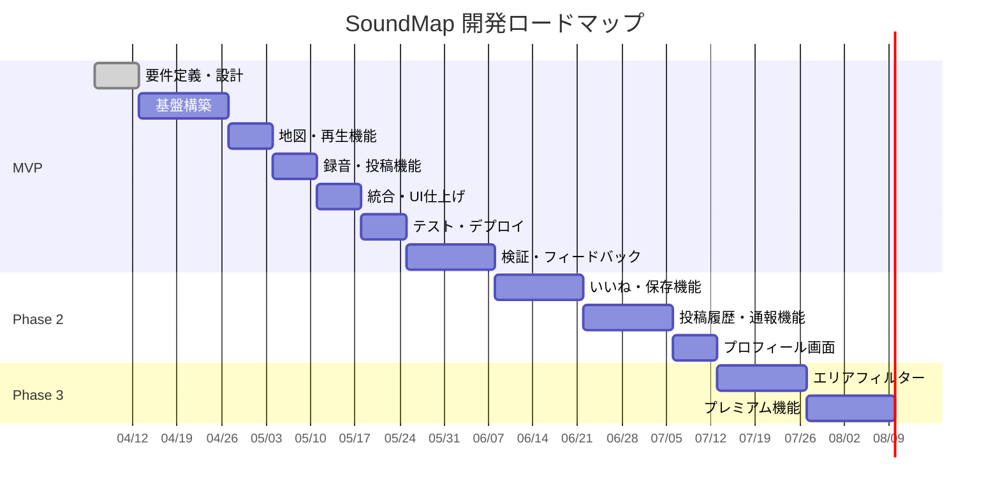
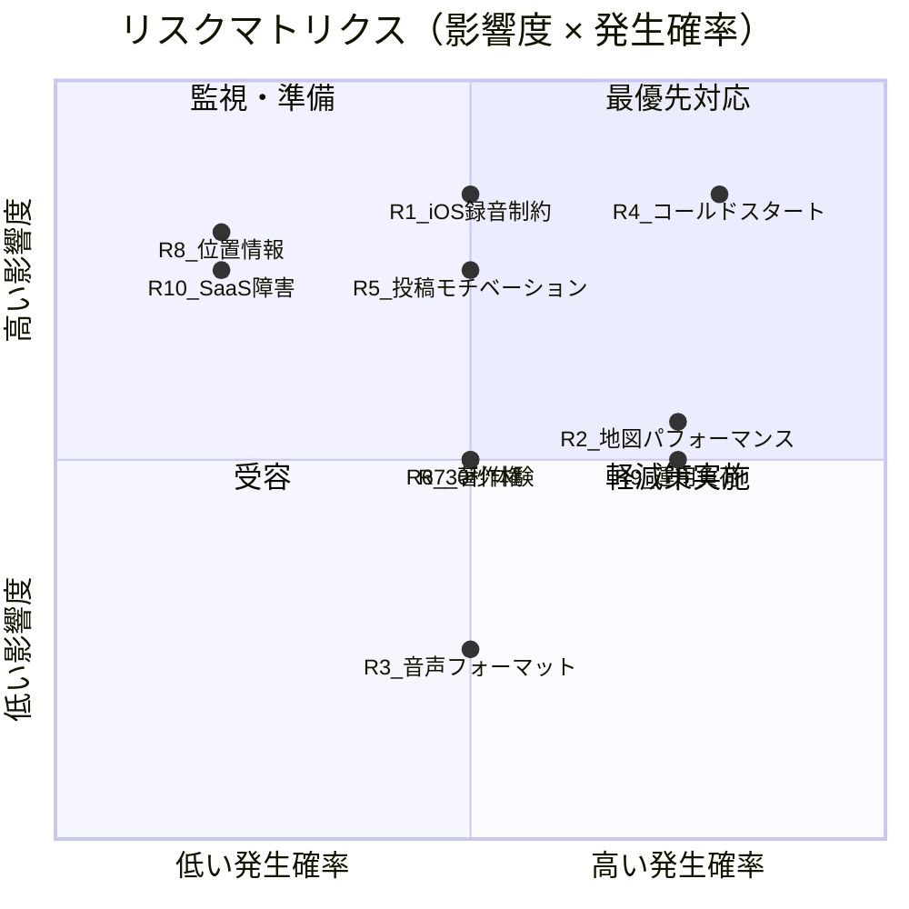
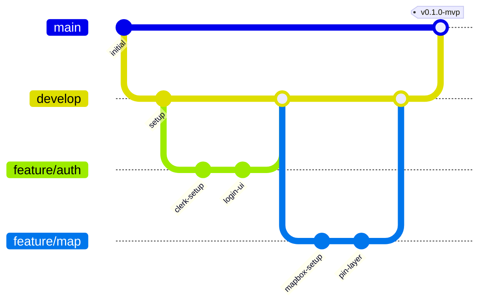

# 開発計画書 — SoundMap

## 1. 開発ロードマップ

### 1.1 フェーズ概要

### 1.2 フェーズ別目標

| フェーズ | 期間 | 目標 | 成功基準 |
|----------|------|------|---------|
| **MVP** | 6 週間 | コア体験の検証に必要な最小機能セットをリリース | 音声の再生・投稿が正常に動作し、初期ユーザーに公開可能な状態 |
| **検証期** | 2 週間 | 初期ユーザーからのフィードバック収集と KPI 計測 | 7 日リテンション率 15% 以上 |
| **Phase 2** | 5 週間 | エンゲージメント強化機能の追加 | 保存・通報機能が動作し、UGC の品質管理が可能 |
| **Phase 3** | 4 週間 | 探索性の向上とマネタイズ基盤の構築 | フィルター・プレミアム機能が動作 |

---

## 2. MVP 開発スケジュール

### 2.1 週次スケジュール

| フェーズ | 期間 | 主なタスク | 成果物 |
|----------|------|-----------|--------|
| **要件定義・設計** | Week 0 | 要件定義書の確定、Supabase スキーマ設計、Figma モック作成 | 設計ドキュメント一式 |
| **基盤構築** | Week 1-2 | プロジェクトセットアップ、Clerk 認証実装、Supabase 接続・マイグレーション | 認証機能が動作するプロジェクト |
| **地図・再生機能** | Week 2-3 | Mapbox 地図表示、ピン表示・クラスタリング、ボトムシート UI、30 秒音声再生、没入オーバーレイ | 地図上のピンから音声再生が可能 |
| **録音・投稿機能** | Week 3-4 | 録音 UI、MediaRecorder 実装、プレビュー再生、位置情報取得、投稿 API、音声アップロード | 音声録音・投稿が可能 |
| **統合・UI 仕上げ** | Week 5 | 画面遷移統合、ダーク UI 仕上げ、レスポンシブ対応、PWA 設定 | 一通りの機能が統合されたアプリ |
| **テスト・デプロイ** | Week 6 | E2E テスト、パフォーマンス検証、iOS Safari 互換テスト、シード投稿作成、本番デプロイ | 本番環境で動作するアプリ |
| **検証・フィードバック** | Week 7-8 | 初期ユーザーへの公開、フィードバック収集、KPI 計測、Phase 2 計画 | フィードバックレポート |

### 2.2 開発モデル

- **アジャイル / イテレーティブ**: MVP → ユーザーフィードバック → 改善のサイクルを高速に回す
- **1 週間スプリント**: 各スプリント終了時にデモ・レビュー
- **バックログ管理**: GitHub Issues で管理。ユーザーフィードバックを基に随時調整

---

## 3. タスク分解（WBS）

### 3.1 Week 0: 要件定義・設計

| タスク ID | タスク | 見積もり | 依存 |
|-----------|--------|---------|------|
| T-001 | 要件定義書の最終レビュー・確定 | 4h | — |
| T-002 | Supabase スキーマ設計・マイグレーション SQL 作成 | 4h | T-001 |
| T-003 | API エンドポイント仕様書の作成 | 3h | T-001 |
| T-004 | Figma での画面モック作成（地図画面、録音画面、オーバーレイ） | 8h | T-001 |
| T-005 | コンポーネント設計・ディレクトリ構成の決定 | 2h | T-001 |

### 3.2 Week 1-2: 基盤構築

| タスク ID | タスク | 見積もり | 依存 |
|-----------|--------|---------|------|
| T-010 | Next.js プロジェクトセットアップ（TypeScript + Tailwind CSS + shadcn/ui） | 2h | — |
| T-011 | ESLint / Prettier / husky 設定 | 1h | T-010 |
| T-012 | Vercel プロジェクト作成・GitHub 連携 | 1h | T-010 |
| T-013 | Supabase プロジェクト作成・接続設定 | 2h | T-010 |
| T-014 | データベースマイグレーション実行（users, posts テーブル） | 2h | T-013, T-002 |
| T-015 | RLS ポリシーの設定・テスト | 3h | T-014 |
| T-016 | Supabase Storage バケット作成（audio）・ポリシー設定 | 2h | T-013 |
| T-017 | Clerk プロジェクト作成・Next.js 統合 | 3h | T-010 |
| T-018 | Clerk 認証 UI の実装（メール / Google / Apple） | 4h | T-017 |
| T-019 | Clerk Webhook エンドポイント実装（ユーザー同期） | 4h | T-017, T-014 |
| T-020 | オンボーディング画面の実装 | 3h | T-010 |
| T-021 | ログイン / 登録画面の実装 | 4h | T-018 |
| T-022 | Zustand ストアのセットアップ | 2h | T-010 |
| T-023 | 環境変数の設定（Vercel / .env.local） | 1h | T-012, T-013, T-017 |
| T-024 | iOS Safari での認証フロー検証 | 2h | T-018 |

### 3.3 Week 2-3: 地図・再生機能

| タスク ID | タスク | 見積もり | 依存 |
|-----------|--------|---------|------|
| T-030 | Mapbox GL JS（react-map-gl）の統合・ダークテーマ設定 | 3h | T-010 |
| T-031 | MapView コンポーネントの実装 | 4h | T-030, T-022 |
| T-032 | `GET /api/posts` API の実装（ビューポートクエリ） | 4h | T-014 |
| T-033 | PinLayer コンポーネントの実装 | 3h | T-031, T-032 |
| T-034 | ClusterLayer コンポーネントの実装（supercluster） | 4h | T-033 |
| T-035 | BottomSheet コンポーネントの実装 | 4h | T-031 |
| T-036 | `GET /api/posts/:id` API の実装 | 2h | T-014 |
| T-037 | AudioPlayer コンポーネントの実装 | 4h | T-035 |
| T-038 | ImmersiveOverlay コンポーネントの実装（カウントダウン・波形） | 4h | T-037 |
| T-039 | `PATCH /api/posts/:id/play` API の実装 | 2h | T-014 |
| T-040 | ハプティクスフィードバックの実装 | 1h | T-038 |
| T-041 | 地図パフォーマンス検証（ビューポート内のみデータ取得） | 2h | T-032, T-034 |

### 3.4 Week 3-4: 録音・投稿機能

| タスク ID | タスク | 見積もり | 依存 |
|-----------|--------|---------|------|
| T-050 | AudioRecorder コンポーネントの実装（MediaRecorder API） | 6h | T-010 |
| T-051 | 録音画面 UI の実装（タイマー・波形） | 4h | T-050 |
| T-052 | プレビュー再生機能の実装 | 2h | T-050 |
| T-053 | 位置情報取得の実装（Geolocation API） | 3h | T-010 |
| T-054 | LocationPicker コンポーネントの実装（手動位置選択） | 4h | T-053, T-030 |
| T-055 | PostForm コンポーネントの実装（場所名入力・投稿確認） | 4h | T-052, T-054 |
| T-056 | `POST /api/posts` API の実装（音声アップロード + メタデータ保存） | 6h | T-014, T-016 |
| T-057 | 投稿完了アニメーション・サクセス演出 | 2h | T-055 |
| T-058 | 未ログイン時の投稿ボタン制御（ログイン画面への遷移） | 2h | T-018 |
| T-059 | iOS Safari での MediaRecorder 互換テスト | 4h | T-050 |
| T-060 | 音声フォーマットのフォールバック実装（WebM → MP4） | 3h | T-050 |

### 3.5 Week 5: 統合・UI 仕上げ

| タスク ID | タスク | 見積もり | 依存 |
|-----------|--------|---------|------|
| T-070 | 全画面遷移の統合・動線テスト | 4h | T-021, T-031〜T-060 |
| T-071 | ダーク UI の仕上げ（カラー・タイポグラフィの統一） | 4h | T-070 |
| T-072 | レスポンシブ対応（タブレット・デスクトップ） | 4h | T-070 |
| T-073 | PWA 設定（manifest.json、Service Worker、アイコン） | 4h | T-070 |
| T-074 | アニメーション・トランジションの調整 | 3h | T-071 |
| T-075 | エラーハンドリングの統一（ネットワークエラー、権限エラー） | 4h | T-070 |
| T-076 | ローディング状態・空状態の UI 実装 | 3h | T-070 |
| T-077 | アクセシビリティ対応（aria-label、フォーカスリング） | 3h | T-071 |

### 3.6 Week 6: テスト・デプロイ

| タスク ID | タスク | 見積もり | 依存 |
|-----------|--------|---------|------|
| T-080 | E2E テストの作成・実行（Playwright） | 8h | T-070 |
| T-081 | パフォーマンス検証（Lighthouse、地図初期表示、音声再生開始） | 3h | T-070 |
| T-082 | iOS Safari 総合互換テスト（認証・録音・再生） | 4h | T-070 |
| T-083 | Android Chrome テスト | 2h | T-070 |
| T-084 | シード投稿 50 件の作成（主要都市・観光地） | 4h | T-056 |
| T-085 | Sentry の導入・エラー監視設定 | 2h | T-070 |
| T-086 | 利用規約・プライバシーポリシーのページ作成 | 3h | — |
| T-087 | 本番環境のセットアップ（Vercel、Supabase、Clerk） | 2h | T-023 |
| T-088 | カスタムドメイン設定・SSL 確認 | 1h | T-087 |
| T-089 | 本番デプロイ・動作確認 | 2h | T-087, T-088 |
| T-090 | OGP / SEO メタタグの設定 | 2h | T-087 |

---

## 4. MVP で実装する機能範囲

### 4.1 MVP 対象機能

| 機能 ID | 機能名 | 概要 |
|---------|--------|------|
| F-001 | メール登録 | メールアドレス＆パスワードでアカウント作成 |
| F-002 | SNS ログイン | Google / Apple アカウントでのログイン |
| F-003 | ログアウト | セッション破棄とログアウト処理 |
| F-004 | パスワードリセット | メール経由でのパスワード再設定 |
| F-005 | 世界地図表示 | 世界地図を表示し、ズーム・スクロール操作が可能 |
| F-006 | ピン表示 | 音声が投稿された場所にピンアイコンを表示 |
| F-007 | ピンクラスタリング | 密集するピンをクラスタとしてまとめて表示 |
| F-008 | 投稿情報表示 | ピンタップでボトムシートに場所名・投稿者名・録音日時を表示 |
| F-009 | 30 秒音声再生 | 再生ボタンタップで 30 秒の環境音を再生、自動停止 |
| F-010 | 没入オーバーレイ | 再生中は画面を暗転させ、残り時間のみ控えめに表示 |
| F-011 | 手動停止 | 再生中に停止ボタンで再生を中断可能 |
| F-012 | 30 秒録音 | スマホのマイクで環境音を最大 30 秒録音（自動停止） |
| F-013 | プレビュー再生 | 投稿前に録音内容を再生確認 |
| F-014 | 録り直し | 録音をやり直し可能 |
| F-015 | 位置情報取得 | 録音時の位置情報を自動取得 |
| F-016 | 位置情報手動設定 | 位置情報取得失敗時に地図上で手動選択 |
| F-017 | 場所名入力 | 投稿に場所名をテキスト入力で付与 |
| F-018 | 音声投稿 | 音声＋位置情報＋場所名をサーバーに送信・公開 |

### 4.2 MVP のゴール

- **検証する仮説**:
  1. 「音だけでリラックスできるか」
  2. 「投稿するモチベーションがあるか」
  3. 「習慣化するか（寝る前の利用）」
- **定量目標**: MVP 公開後 3 ヶ月でアクティブユーザー 100 人、7 日リテンション率 15% 以上
- **方法**: 初期ユーザー（友人・知人）からのフィードバックを基にプロダクト方針を決定

---

## 5. リスク管理

### 5.1 リスク一覧

| No | カテゴリ | リスク内容 | 影響度 | 発生確率 | 対応策 |
|----|---------|-----------|--------|----------|--------|
| R1 | 技術 | iOS の PWA 録音制約（MediaRecorder API 非対応 / 制限） | 高 | 中 | Week 1 で iOS Safari 検証を最優先実施。制約がある場合は Capacitor 導入を検討 |
| R2 | 技術 | 地図パフォーマンス劣化（ピン増加時） | 中 | 高 | ピンクラスタリング、ビューポート内のみデータ取得、遅延読み込み |
| R3 | 技術 | ブラウザ間の音声フォーマット非互換 | 低 | 中 | WebM / MP4 の自動判定。将来的にサーバーサイド変換を検討 |
| R4 | ビジネス | コールドスタート問題（地図上のピンがスカスカ） | 高 | 高 | 運営が 50〜100 件のシード投稿を用意。主要都市・観光地をカバー |
| R5 | ビジネス | 投稿モチベーション不足 | 高 | 中 | Phase 2 で投稿数バッジ、再生回数表示を追加。投稿体験の楽しさを磨く |
| R6 | ビジネス | 30 秒体験が物足りない / 長すぎる | 中 | 中 | ユーザーテストで満足度を計測。秒数の A/B テストを検討 |
| R7 | 法務 | 著作権侵害の音声投稿（音楽等） | 中 | 中 | 利用規約で環境音のみの投稿を明記。将来的に音楽検出 API 導入 |
| R8 | 法務 | 位置情報の個人情報保護 | 高 | 低 | 投稿時のみ取得。プライバシーポリシーで明示。個人情報保護法準拠 |
| R9 | 運用 | 少人数チームでの運用負荷 | 中 | 高 | 手動レビューを最小限に。Supabase Dashboard で運用 |
| R10 | 技術 | SaaS（Clerk / Supabase / Mapbox）の仕様変更・障害 | 高 | 低 | 代替サービスの事前調査。API バージョン固定 |

### 5.2 リスク対応の優先度

### 5.3 最優先リスクへの対応計画

| リスク | 対応タイミング | 対応内容 |
|--------|--------------|---------|
| **R1: iOS 録音制約** | Week 1（最優先） | iOS Safari で MediaRecorder API の動作検証を実施。非対応の場合は `audio/mp4` フォールバックまたは Capacitor 導入を判断 |
| **R4: コールドスタート** | Week 6（デプロイ前） | チームメンバーで主要 10 都市（東京、大阪、京都、福岡、札幌、沖縄、パリ、ニューヨーク、ロンドン、バリ）の環境音を各 5〜10 件録音・投稿 |
| **R5: 投稿モチベーション** | Week 7-8（検証期） | 初期ユーザーへのヒアリング。投稿しやすい UI の改善。投稿のきっかけとなるプロンプトの表示を検討 |

---

## 6. 開発環境・ツール

| カテゴリ | ツール | 用途 |
|---------|--------|------|
| エディタ | Cursor / VS Code | コーディング |
| バージョン管理 | GitHub | ソースコード管理、Issue、PR |
| CI/CD | Vercel（自動デプロイ） | ビルド・テスト・デプロイ |
| リンター / フォーマッター | ESLint + Prettier | コード品質 |
| テスト | Playwright | E2E テスト |
| テスト | Vitest | ユニットテスト |
| 監視 | Sentry | フロントエンドエラー監視 |
| 監視 | Vercel Analytics | パフォーマンス監視 |
| デザイン | Figma | 画面モック・プロトタイプ |
| コミュニケーション | GitHub Issues / Discussions | タスク管理・議論 |

---

## 7. ブランチ戦略

| ブランチ | 用途 | マージ先 |
|---------|------|---------|
| `main` | 本番デプロイ用。安定版 | — |
| `develop` | 開発統合ブランチ | `main` |
| `feature/*` | 機能開発用 | `develop` |
| `fix/*` | バグ修正用 | `develop` |
| `hotfix/*` | 緊急修正用 | `main` + `develop` |

---

## 8. 課題・前提条件

### 8.1 未確定事項

| 項目 | 現状 | 確定期限 |
|------|------|---------|
| 開発チームのスキルセット | 仮定: Next.js / React / TypeScript 経験あり | Week 0 |
| PWA vs ネイティブアプリの最終判断 | 仮定: PWA で進行 | Week 1（iOS 検証後） |
| シード投稿の調達方法・担当者 | 未確定 | Week 4 |
| 利用規約・プライバシーポリシーの策定 | 未着手 | Week 5 |
| 地図 API の予算上限 | 仮定: Mapbox 無料枠内で運用 | Week 2 |
| カスタムドメイン | 仮定: `soundmap.app` | Week 5 |

### 8.2 撤退基準

- MVP 公開後 3 ヶ月で 7 日リテンション率が 10% を下回る場合
- 投稿数が自然増加せず、コンテンツ供給が止まる場合
