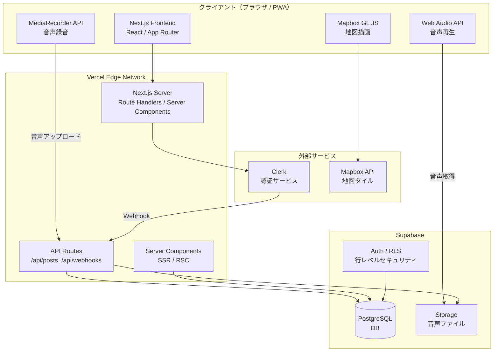
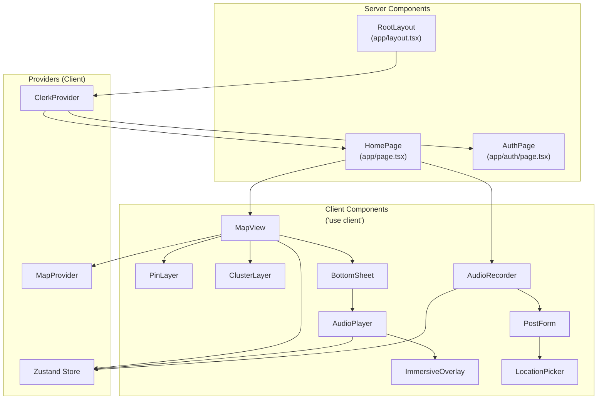
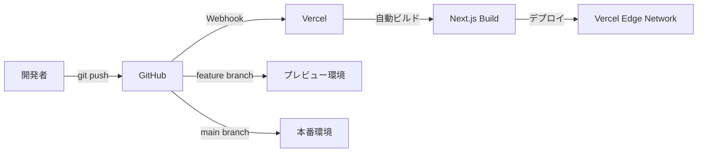

# システムアーキテクチャ設計書 — SoundMap

## 1. 技術スタック

| レイヤー | 技術 | バージョン | 選定理由 |
|----------|------|-----------|----------|
| フロントエンド | Next.js (React) | 16以降 | App Router によるサーバーサイドレンダリング・React Server Components 対応。Vercel との統合が最もスムーズ |
| 言語 | TypeScript | 5.x | 型安全性による開発品質の向上。フロント〜バックエンドの型共有が可能 |
| バックエンド | Next.js App Router (Route Handlers / Server Actions) | — | フロントエンドと同一リポジトリで API を管理でき、少人数チームの生産性を最大化 |
| データベース | Supabase (PostgreSQL) | — | RLS（Row Level Security）によるセキュリティ、Storage 一体型、無料枠が MVP に十分 |
| 認証 | Clerk | — | メール / Google / Apple 認証を数行で実装可能。Webhook で Supabase と同期 |
| ホスティング / デプロイ | Vercel | — | Next.js の開発元。Edge Network による高速配信、自動デプロイ、プレビュー環境 |
| 地図 | Mapbox GL JS (react-map-gl) | — | ダークテーマ対応、ピンクラスタリング（supercluster）、60fps のスムーズな地図操作 |
| 音声処理 | Web Audio API / MediaRecorder API | — | ブラウザネイティブ API。追加ライブラリ不要で PWA との相性が良い |
| ストレージ | Supabase Storage | — | DB と同一プラットフォームで管理可能。認証付き URL でアクセス制御 |
| スタイリング | Tailwind CSS | 4.x | ユーティリティファーストでダークテーマの実装が容易。ビルドサイズが小さい |
| 状態管理 | Zustand | — | 軽量・シンプル。React 外からもアクセス可能で、地図状態の管理に適している |
| UIコンポーネント | shadcn/ui | — | Tailwind CSS ベース。カスタマイズ性が高く、ダークテーマへの適用が容易 |

---

## 2. アーキテクチャ概要

### 2.1 全体構成図



### 2.2 コンポーネント間のデータフロー

| フロー | 経路 | プロトコル | 説明 |
|--------|------|-----------|------|
| 地図タイル取得 | Client → Mapbox API | HTTPS | ダークテーマスタイルの地図タイルを取得 |
| 投稿データ取得 | Client → Vercel → Supabase DB | HTTPS (REST) | ビューポート内のピンデータをJSON で取得 |
| 音声再生 | Client → Supabase Storage | HTTPS | 認証付き URL で音声ファイルを直接取得 |
| 音声投稿 | Client → Vercel API → Supabase Storage + DB | HTTPS (multipart) | 音声ファイルを Storage にアップロード、メタデータを DB に保存 |
| 認証 | Client → Clerk → Vercel API (Webhook) → Supabase DB | HTTPS | Clerk でユーザー認証。Webhook でユーザー情報を DB に同期 |

### 2.3 各コンポーネントの役割

| コンポーネント | 役割 |
|---------------|------|
| **Vercel Edge Network** | Next.js アプリケーションのホスティング。CDN によるグローバル配信。API Routes の実行環境 |
| **Next.js App Router** | フロントエンド UI のレンダリング（RSC / SSR）と API エンドポイントの提供 |
| **Supabase PostgreSQL** | 投稿データ・ユーザーデータの永続化。RLS による行レベルのアクセス制御 |
| **Supabase Storage** | 音声ファイル（WebM / MP4）の保存・配信。CDN キャッシュによる高速配信 |
| **Clerk** | ユーザー認証（メール / Google / Apple）。JWT トークン発行。Webhook によるユーザー同期 |
| **Mapbox** | 世界地図のレンダリング（ダークテーマ）。地図タイルの配信 |

---

## 3. コンポーネント設計

### 3.1 コンポーネント階層図



### 3.2 Server / Client Components の区分

| コンポーネント | 区分 | 理由 |
|---------------|------|------|
| `RootLayout` | Server | 静的なレイアウト。メタデータの設定 |
| `HomePage` | Server | 初期データのフェッチ不要（地図はクライアントで描画） |
| `AuthPage` | Server | Clerk コンポーネントのラッパー |
| `MapView` | Client | Mapbox GL JS はブラウザ API に依存。インタラクティブな操作が必要 |
| `PinLayer` / `ClusterLayer` | Client | 地図上のレイヤー描画。MapView の子コンポーネント |
| `BottomSheet` | Client | アニメーション付きのスライドアップ UI |
| `AudioPlayer` | Client | Web Audio API / HTMLAudioElement によるブラウザ再生 |
| `ImmersiveOverlay` | Client | カウントダウンタイマー、波形アニメーション |
| `AudioRecorder` | Client | MediaRecorder API によるマイクアクセス |
| `PostForm` | Client | フォーム入力・ファイルアップロード |
| `LocationPicker` | Client | Geolocation API / 地図 UI による位置選択 |

### 3.3 主要コンポーネント仕様

#### `MapView` — 地図描画コンポーネント

- **区分**: Client Component（`'use client'`）
- **責務**: Mapbox GL JS の地図を描画し、ピンの表示・インタラクションを管理
- **Props**:

```typescript
interface MapViewProps {
  initialCenter?: { lat: number; lng: number };
  initialZoom?: number;
}
```

- **Zustand ストアで管理する状態**:
  - `viewState`: 地図のビューステート（center, zoom, bounds）
  - `selectedPostId`: 選択中のピンの投稿 ID（`null` = 未選択）
  - `posts`: ビューポート内の投稿データ配列
- **主要ロジック**:
  - ビューポート変更時に `/api/posts` をデバウンス付き（300ms）で呼び出し、ピンデータを取得
  - `react-map-gl` の `Map` コンポーネントをラップ
  - ピンクラスタリングは Mapbox の `supercluster` で処理
  - 地図スタイル: `mapbox://styles/mapbox/dark-v11`

#### `AudioPlayer` — 音声再生コンポーネント

- **区分**: Client Component（`'use client'`）
- **責務**: 30 秒間の音声再生と没入オーバーレイの表示制御
- **Props**:

```typescript
interface AudioPlayerProps {
  audioUrl: string;
  postId: string;
  placeName: string;
  onClose: () => void;
}
```

- **ローカル状態** (`useState`):
  - `isPlaying: boolean` — 再生中かどうか
  - `remainingSeconds: number` — 残り秒数
  - `showOverlay: boolean` — 没入オーバーレイの表示
- **主要ロジック**:
  - `HTMLAudioElement` で音声を再生。`useRef` で Audio 要素を保持
  - `useEffect` で 1 秒ごとのカウントダウンタイマー
  - 30 秒経過で自動停止 → `PATCH /api/posts/:id/play` で再生回数をインクリメント
  - `navigator.vibrate(50)` でハプティクスフィードバック（対応端末のみ）

#### `AudioRecorder` — 音声録音コンポーネント

- **区分**: Client Component（`'use client'`）
- **責務**: MediaRecorder API を使用した 30 秒間の音声録音
- **Props**:

```typescript
interface AudioRecorderProps {
  onRecordingComplete: (audioBlob: Blob, durationMs: number) => void;
  onCancel: () => void;
}
```

- **ローカル状態** (`useState`):
  - `recordingState: 'idle' | 'recording' | 'recorded'` — 録音の状態
  - `elapsedSeconds: number` — 経過秒数
  - `audioBlob: Blob | null` — 録音された音声データ
- **主要ロジック**:
  - `navigator.mediaDevices.getUserMedia({ audio: true })` でマイクアクセスを取得
  - `MediaRecorder` で録音。`mimeType` は `audio/webm;codecs=opus` を優先、非対応時は `audio/mp4` にフォールバック
  - 30 秒で `mediaRecorder.stop()` を自動呼び出し
  - 録音データは `Blob` として保持し、プレビュー再生・投稿に使用

---

## 4. 状態管理設計

### 4.1 Zustand ストア構成

```typescript
interface SoundMapStore {
  // 地図の状態
  viewState: {
    latitude: number;
    longitude: number;
    zoom: number;
    bounds: [number, number, number, number] | null;
  };
  setViewState: (viewState: Partial<SoundMapStore['viewState']>) => void;

  // 投稿データ
  posts: Post[];
  setPosts: (posts: Post[]) => void;
  selectedPostId: string | null;
  setSelectedPostId: (id: string | null) => void;

  // 再生状態
  isPlaying: boolean;
  setIsPlaying: (playing: boolean) => void;

  // 録音状態
  isRecording: boolean;
  setIsRecording: (recording: boolean) => void;
}
```

### 4.2 状態管理の方針

| 状態の種類 | 管理方法 | 理由 |
|-----------|---------|------|
| 地図のビューステート | Zustand | 複数コンポーネント（MapView, PinLayer）で共有。ビューポート変更時の API 呼び出しトリガー |
| 選択中の投稿 | Zustand | BottomSheet と MapView で共有が必要 |
| 投稿一覧データ | Zustand | ビューポート内のデータキャッシュ |
| 再生状態 | Zustand + `useState` | グローバルな再生中フラグは Zustand、カウントダウン等の UI 状態は `useState` |
| 録音状態 | `useState` | AudioRecorder 内でのみ使用するローカル状態 |
| フォーム入力 | `useState` | PostForm 内でのみ使用するローカル状態 |
| 認証状態 | Clerk (`useUser`, `useAuth`) | Clerk SDK が提供する hooks を使用 |

---

## 5. ディレクトリ構成

```
src/
├── app/                          # Next.js App Router
│   ├── layout.tsx                # RootLayout (Server Component)
│   ├── page.tsx                  # HomePage (Server Component)
│   ├── auth/
│   │   └── page.tsx              # AuthPage
│   ├── record/
│   │   └── page.tsx              # 録音画面
│   ├── api/
│   │   ├── posts/
│   │   │   ├── route.ts          # GET /api/posts, POST /api/posts
│   │   │   └── [id]/
│   │   │       ├── route.ts      # GET /api/posts/:id
│   │   │       └── play/
│   │   │           └── route.ts  # PATCH /api/posts/:id/play
│   │   └── webhooks/
│   │       └── clerk/
│   │           └── route.ts      # POST /api/webhooks/clerk
│   └── globals.css               # グローバルスタイル
├── components/
│   ├── map/
│   │   ├── MapView.tsx           # 地図メインコンポーネント
│   │   ├── PinLayer.tsx          # ピン描画レイヤー
│   │   └── ClusterLayer.tsx      # クラスタ描画レイヤー
│   ├── audio/
│   │   ├── AudioPlayer.tsx       # 音声再生
│   │   ├── AudioRecorder.tsx     # 音声録音
│   │   └── ImmersiveOverlay.tsx  # 没入オーバーレイ
│   ├── post/
│   │   ├── BottomSheet.tsx       # 投稿情報ボトムシート
│   │   ├── PostForm.tsx          # 投稿フォーム
│   │   └── LocationPicker.tsx    # 位置情報選択
│   └── ui/                      # shadcn/ui コンポーネント
├── lib/
│   ├── supabase.ts               # Supabase クライアント初期化
│   ├── store.ts                  # Zustand ストア定義
│   └── utils.ts                  # ユーティリティ関数
├── types/
│   └── index.ts                  # 型定義
└── providers/
    ├── ClerkProvider.tsx          # Clerk Provider ラッパー
    └── MapProvider.tsx            # Map Provider
```

---

## 6. インフラ・デプロイ構成

### 6.1 デプロイフロー



### 6.2 環境構成

| 環境 | URL | 用途 |
|------|-----|------|
| ローカル開発 | `http://localhost:3000` | 開発・デバッグ |
| プレビュー | `https://<branch>.vercel.app` | PR ごとのプレビュー |
| 本番 | `https://soundmap.app`（仮） | ユーザーへの公開環境 |

### 6.3 環境変数

| 変数名 | 用途 | 設定場所 |
|--------|------|---------|
| `NEXT_PUBLIC_CLERK_PUBLISHABLE_KEY` | Clerk フロントエンド用キー | Vercel / `.env.local` |
| `CLERK_SECRET_KEY` | Clerk サーバー用シークレット | Vercel |
| `CLERK_WEBHOOK_SECRET` | Clerk Webhook 署名検証キー | Vercel |
| `NEXT_PUBLIC_SUPABASE_URL` | Supabase プロジェクト URL | Vercel / `.env.local` |
| `NEXT_PUBLIC_SUPABASE_ANON_KEY` | Supabase 公開キー | Vercel / `.env.local` |
| `SUPABASE_SERVICE_ROLE_KEY` | Supabase 管理者キー（サーバー側のみ） | Vercel |
| `NEXT_PUBLIC_MAPBOX_TOKEN` | Mapbox アクセストークン | Vercel / `.env.local` |

---

## 7. キャッシュ・パフォーマンス戦略

| 対象 | 戦略 | 詳細 |
|------|------|------|
| 地図タイル | ブラウザキャッシュ | Mapbox GL JS がタイルを自動キャッシュ |
| 音声ファイル | CDN キャッシュ | Supabase Storage の CDN。`Cache-Control: public, max-age=31536000` |
| 投稿データ (API) | クライアントキャッシュ | Zustand ストアでビューポート内データを保持。ビューポート変更時に再取得 |
| API レスポンス | ISR 不使用 | 投稿データはリアルタイム性が求められるため、SSG / ISR は使用しない |
| 静的アセット | Vercel CDN | Next.js の `public/` ディレクトリ経由で配信。自動キャッシュ |
