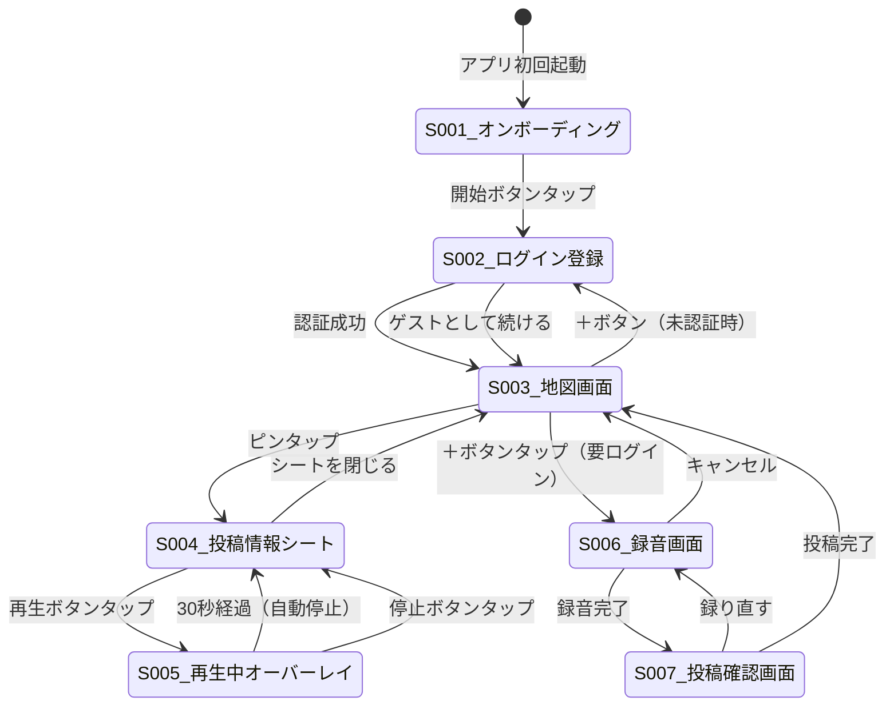

# UI/UX設計書 — SoundMap

## 1. デザインコンセプト

### 1.1 コンセプトステートメント

> **「静寂の中の探索」**
> 暗い部屋でベッドに横たわり、目を閉じる直前に触れるアプリ。余計な情報を削ぎ落とし、「音」と「地図」だけが主役になる没入型 UI。

### 1.2 デザイン原則

| 原則 | 説明 | 具体例 |
|------|------|--------|
| **ダーク・ミニマル** | 寝る前の利用を前提とし、目に優しいダーク UI | 全画面ダークテーマ。白い要素は使わない |
| **没入型** | 音を聴く体験を最優先。余計な情報を極限まで排除 | 再生中は画面を暗転し、残り時間のみ表示 |
| **引き算** | 通知・数字・バッジなど刺激的な要素を排除 | いいね数やフォロワー数を表示しない（MVP） |
| **操作の最小化** | コア体験は 3 ステップ以内で完結 | 開く → タップ → 聴く |
| **静謐で上品** | 主張しすぎないタイポグラフィ、控えめなアニメーション | ボトムシートのスライドアップ程度の遷移演出 |

### 1.3 避けるべき要素

- 通知バッジ
- 数字の強調表示（フォロワー数、いいね数の目立つ表示）
- 無限スクロール
- 自動再生の連続
- 派手なアニメーション・トランジション
- ポップアップ広告

### 1.4 参考サービス

| サービス名 | 参考にする点 |
|------------|-------------|
| Headspace | ダーク UI、リラックスを促す体験設計 |
| Dark Noise | 環境音アプリの UI、シンプルな操作性 |
| Google Earth | 地図の没入感、探索する楽しさ |
| Muji to Sleep | 余計な情報を削ぎ落としたミニマル UI |

---

## 2. デザインシステム

### 2.1 カラーパレット

| 用途 | カラー名 | HEX コード | 使用箇所 |
|------|---------|-----------|----------|
| 背景（プライマリ） | ディープブラック | `#0a0a0f` | 没入オーバーレイ、メイン背景 |
| 背景（セカンダリ） | ダークグレー | `#121212` | 通常画面の背景 |
| サーフェス（カード・シート） | ダークネイビー | `#1a1a2e` | ボトムシート、カード、入力フィールド |
| サーフェス（ホバー） | ネイビー | `#16213e` | ボタンホバー、選択状態 |
| アクセント（プライマリ） | ソフトブルー | `#5B8DEF` | 再生ボタン、ピンアイコン、リンク |
| アクセント（セカンダリ） | アンバー | `#E8A838` | 録音ボタン、ハイライト、CTA |
| テキスト（プライマリ） | オフホワイト | `#e0e0e0` | 見出し、本文 |
| テキスト（セカンダリ） | グレー | `#888888` | 補足情報、キャプション |
| テキスト（非アクティブ） | ダークグレー | `#555555` | プレースホルダー、無効状態 |
| エラー | ソフトレッド | `#EF5B5B` | バリデーションエラー、録音中表示 |
| 成功 | ソフトグリーン | `#5BEF8D` | 投稿完了、成功メッセージ |

### 2.2 タイポグラフィ

| 用途 | フォント | サイズ | ウェイト | 行間 |
|------|----------|--------|----------|------|
| 見出し（H1） | Inter / Noto Sans JP | 24px | 300 (Light) | 1.4 |
| 見出し（H2） | Inter / Noto Sans JP | 20px | 400 (Regular) | 1.4 |
| 本文 | Inter / Noto Sans JP | 14px | 400 (Regular) | 1.6 |
| キャプション | Inter / Noto Sans JP | 12px | 400 (Regular) | 1.5 |
| ボタン | Inter / Noto Sans JP | 16px | 500 (Medium) | 1.0 |
| 残り時間表示 | Inter (monospace) | 48px | 200 (Extra Light) | 1.0 |

**フォント選定理由**:
- **Inter**: 画面表示に最適化された可変フォント。小サイズでの可読性が高い
- **Noto Sans JP**: 日本語表示用。Google Fonts で無料配信。Inter との調和が良い

### 2.3 アイコン

| 方針 | 詳細 |
|------|------|
| スタイル | ラインアイコン（細め、1.5px ストローク） |
| ライブラリ | Lucide React（shadcn/ui 標準） |
| カラー | テキストカラーに準じる。アクセントカラーは CTA のみ |
| サイズ | 20px（標準）、24px（ナビゲーション）、32px（FAB） |

### 2.4 スペーシング

| 名前 | 値 | 用途 |
|------|-----|------|
| `xs` | 4px | アイコンとテキストの間隔 |
| `sm` | 8px | 要素内の余白 |
| `md` | 16px | セクション間の余白 |
| `lg` | 24px | カード内のパディング |
| `xl` | 32px | セクション間の大きな余白 |
| `2xl` | 48px | ページレベルの余白 |

### 2.5 角丸

| 用途 | 値 |
|------|-----|
| ボタン | 12px |
| カード / シート | 16px（上端のみ） |
| 入力フィールド | 8px |
| アバター | 50%（円形） |
| ピンアイコン | 50%（円形） |

### 2.6 シャドウ・エレベーション

ダーク UI のためシャドウは控えめに使用。代わりにボーダーと背景色の差で階層を表現する。

| レベル | 用途 | 実装 |
|--------|------|------|
| Level 0 | 背景 | `#121212`（背景色） |
| Level 1 | カード・シート | `#1a1a2e`（背景色を変更） |
| Level 2 | ボトムシート | `border-top: 1px solid #2a2a3e` |
| Level 3 | モーダル・オーバーレイ | `#0a0a0f` + 95% 不透明度 |

---

## 3. 画面一覧と画面遷移図

### 3.1 画面一覧

| 画面 ID | 画面名 | 目的 | フェーズ | 認証要否 |
|---------|--------|------|----------|---------|
| S-001 | オンボーディング | コンセプト紹介（1〜2 枚） | MVP | 不要 |
| S-002 | ログイン / 登録 | アカウント認証 | MVP | 不要 |
| S-003 | 地図画面（ホーム） | 音を探して聴くメイン画面 | MVP | 不要 |
| S-004 | 投稿情報ボトムシート | 音の詳細確認・再生開始 | MVP | 不要 |
| S-005 | 再生中オーバーレイ | 30 秒の没入体験 | MVP | 不要 |
| S-006 | 録音画面 | 環境音を録音 | MVP | 必須 |
| S-007 | 投稿確認画面 | 録音内容の確認・場所名入力・投稿 | MVP | 必須 |
| S-008 | 保存一覧画面 | 保存した音をリスト表示 | Phase 2 | 必須 |
| S-009 | 投稿履歴画面 | 自分の投稿をリスト表示 | Phase 2 | 必須 |
| S-010 | プロフィール画面 | ユーザー情報・設定 | Phase 2 | 必須 |

### 3.2 画面遷移図



---

## 4. 主要画面ワイヤーフレーム

### 4.1 S-001: オンボーディング画面

```
┌─────────────────────────────────┐
│                                 │
│                                 │
│                                 │
│         🎧                     │
│                                 │
│    目を閉じて30秒、             │
│    音で旅しよう                 │
│                                 │
│    世界中の誰かが録った          │
│    環境音を、地図から探す。      │
│                                 │
│                                 │
│    ● ○                         │ ← ページインジケーター
│                                 │
│    [ はじめる ]                 │ ← プライマリボタン
│                                 │
└─────────────────────────────────┘
```

**UI コンポーネント**:
- ページインジケーター（1〜2 ページ）
- コンセプトテキスト（H1: Light）
- 補足テキスト（本文サイズ、セカンダリカラー）
- CTA ボタン（アクセントブルー、フル幅）

**インタラクション**:
- スワイプでページ切り替え
- 「はじめる」タップでログイン / 登録画面に遷移
- 2 回目以降のアクセスではスキップ（`localStorage` で制御）

---

### 4.2 S-002: ログイン / 登録画面

```
┌─────────────────────────────────┐
│                                 │
│                                 │
│         SoundMap               │ ← ロゴ（Light ウェイト）
│    音で旅する地図SNS            │ ← サブタイトル
│                                 │
│  ┌───────────────────────────┐  │
│  │ メールアドレス              │  │
│  └───────────────────────────┘  │
│  ┌───────────────────────────┐  │
│  │ パスワード                  │  │
│  └───────────────────────────┘  │
│                                 │
│  [ ログイン / 登録 ]            │ ← プライマリボタン
│                                 │
│  ─────── または ───────        │ ← セパレーター
│                                 │
│  [ G  Googleで続ける ]         │ ← SNSログインボタン
│  [   Appleで続ける  ]         │
│                                 │
│  パスワードをお忘れですか？     │ ← テキストリンク
│                                 │
│  ゲストとして地図を見る →       │ ← 未認証でも閲覧可能
└─────────────────────────────────┘
```

**UI コンポーネント**:
- ロゴテキスト（H1）
- メール入力フィールド（ダークネイビー背景、オフホワイトテキスト）
- パスワード入力フィールド（表示 / 非表示トグル付き）
- プライマリ CTA ボタン（ソフトブルー）
- SNS ログインボタン（Google: 白枠線、Apple: 白背景黒文字）
- テキストリンク（パスワードリセット）
- ゲスト閲覧リンク

**インタラクション**:
- 入力エラー時: フィールド下部にインラインでリアルタイム表示（ソフトレッド）
- パスワード要件: 8 文字以上、英数字混在
- ログイン / 登録はタブ切り替えではなく、メールアドレスの登録有無で自動判定
- SNS ログインボタンは視認性の高いサイズ（寝る前の操作を考慮、高さ 48px 以上）

---

### 4.3 S-003: 地図画面（ホーム）

```
┌─────────────────────────────────┐
│  SoundMap              [👤]     │ ← ヘッダー（ロゴ + プロフィールアイコン）
├─────────────────────────────────┤
│                                 │
│                                 │
│         ┌─[📍]──┐              │
│         │       │              │
│    [📍] │  MAP  │    [📍]     │ ← 世界地図（Mapbox Dark）
│         │       │              │    ピン = 音声スポット
│    [📍📍] └───────┘   [📍]     │    クラスタ表示
│                                 │
│                                 │
│                                 │
│                         [＋]    │ ← 投稿ボタン（FAB, 右下）
└─────────────────────────────────┘
```

**UI コンポーネント**:
- **ヘッダー**: 高さ 48px。ロゴテキスト（左）、プロフィールアイコン（右、24px 円形）
- **地図**: Mapbox GL JS。スタイル `mapbox://styles/mapbox/dark-v11`。全画面表示
- **ピンアイコン**: ソフトブルー（`#5B8DEF`）の 12px 円形。タップ領域は 44px 以上
- **クラスタアイコン**: ピン数を表示する円形バッジ。サイズはピン数に比例
- **FAB（投稿ボタン）**: アンバー（`#E8A838`）、56px 円形。右下に固定配置。影付き

**インタラクション**:
- ピンチ / スプレッドでズーム
- ドラッグでスクロール
- ピンタップでボトムシート（S-004）を表示
- FAB タップで録音画面（S-006）に遷移。未認証時はログイン画面に遷移
- 初期表示位置: ユーザーの現在地（位置情報許可時）またはデフォルト（東京、ズーム 3）

---

### 4.4 S-004: 投稿情報ボトムシート

```
┌─────────────────────────────────┐
│         MAP (背景・半透明)       │
│                                 │
│                                 │
├─────────────────────────────────┤
│  ─── (ドラッグハンドル)         │ ← 4px × 32px のグレーバー
│                                 │
│  📍 渋谷スクランブル交差点      │ ← 場所名（H2、オフホワイト）
│  @shota_t ・ 2026/03/15 18:30  │ ← 投稿者名・日時（キャプション、グレー）
│                                 │
│       [ ▶ 再生する ]           │ ← 再生ボタン（ソフトブルー、フル幅）
│                                 │
└─────────────────────────────────┘
```

**UI コンポーネント**:
- **ドラッグハンドル**: 4px × 32px、`#555555`、角丸 2px
- **場所名**: H2 サイズ（20px）、オフホワイト
- **投稿者情報**: キャプションサイズ（12px）、グレー。`@username ・ YYYY/MM/DD HH:mm` 形式
- **再生ボタン**: ソフトブルー背景、白テキスト、高さ 48px、角丸 12px

**レイアウト**:
- シート高さ: 画面の 30〜40%
- 背景: ダークネイビー（`#1a1a2e`）
- 上端: 角丸 16px
- 地図はシートの背景として半透明で表示

**インタラクション**:
- 下方向スワイプでシートを閉じる
- 背景タップでシートを閉じる
- 再生ボタンタップで没入オーバーレイ（S-005）を表示
- シート表示時: 選択中のピンをハイライト（アンバーに変化）

---

### 4.5 S-005: 再生中オーバーレイ

```
┌─────────────────────────────────┐
│                                 │
│                                 │
│                                 │
│                                 │
│          0:18                   │ ← 残り時間（48px, Extra Light）
│                                 │
│     ～～～～～～～～            │ ← 波形アニメーション
│                                 │
│    渋谷スクランブル交差点       │ ← 場所名（控えめ、グレー）
│                                 │
│                                 │
│          [ ⏹ ]                 │ ← 停止ボタン（円形、40px）
│                                 │
└─────────────────────────────────┘
```

**UI コンポーネント**:
- **背景**: `#0a0a0f`、95% 不透明度。フルスクリーン
- **残り時間**: Inter monospace、48px、Extra Light（200）、オフホワイト。`0:SS` 形式
- **波形アニメーション**: 音声に同期した控えめなパルス。ソフトブルーのライン 5〜7 本
- **場所名**: 14px、グレー（`#888888`）。残り時間の下に控えめに表示
- **停止ボタン**: 40px 円形、ボーダーのみ（`#555555`）。中央に ⏹ アイコン

**インタラクション**:
- オーバーレイ表示時: フェードイン（300ms）
- 再生開始時: `navigator.vibrate(50)` でハプティクスフィードバック
- カウントダウン: 1 秒ごとに残り時間を更新
- 30 秒経過: フェードアウト（500ms）でオーバーレイを閉じ、ボトムシートに戻る
- 停止ボタンタップ: 即時停止、フェードアウトでボトムシートに戻る
- 波形アニメーション: CSS アニメーション。音声レベルに応じた高さ変化

---

### 4.6 S-006: 録音画面

```
┌─────────────────────────────────┐
│  ← 戻る          録音           │ ← ヘッダー
├─────────────────────────────────┤
│                                 │
│                                 │
│         0:15 / 0:30             │ ← タイマー（H1、中央）
│                                 │
│     ～～～～～～～～～～        │ ← リアルタイム波形
│     （リアルタイム波形）        │
│                                 │
│                                 │
│                                 │
│          [  🔴  ]               │ ← 録音ボタン（64px 円形）
│       （録音 / 停止ボタン）     │
│                                 │
│                                 │
└─────────────────────────────────┘
```

**UI コンポーネント**:
- **ヘッダー**: 「← 戻る」ボタン（左）、「録音」タイトル（中央）
- **タイマー**: `0:SS / 0:30` 形式、24px、Light。録音前は `0:00 / 0:30`
- **波形表示**: 録音中のリアルタイム音声波形。ソフトブルーのバー。Web Audio API の `AnalyserNode` で取得
- **録音ボタン**: 64px 円形。
  - 待機中: アンバー（`#E8A838`）背景、中央にマイクアイコン
  - 録音中: ソフトレッド（`#EF5B5B`）背景、中央に ⏹ アイコン。外周にパルスアニメーション

**インタラクション**:
- 録音ボタンタップ（待機中）: マイク権限リクエスト（初回のみ）→ 録音開始 → タイマー進行
- 録音ボタンタップ（録音中）: 手動停止 → 投稿確認画面に遷移
- 30 秒経過: 自動停止 → 投稿確認画面に遷移
- 「戻る」タップ: 録音をキャンセルして地図画面に戻る（確認ダイアログなし）

---

### 4.7 S-007: 投稿確認画面

```
┌─────────────────────────────────┐
│  ← 戻る       投稿確認         │ ← ヘッダー
├─────────────────────────────────┤
│                                 │
│  ▶ プレビュー再生   0:30      │ ← 再生プレビュー
│  ───────────●────────          │ ← シークバー
│                                 │
│  📍 位置情報                   │ ← セクションラベル
│  東京都渋谷区... [地図で修正]  │ ← 位置情報 + 修正リンク
│  ┌───────────────────────┐    │
│  │    [ミニマップ]        │    │ ← 位置確認用ミニマップ
│  └───────────────────────┘    │
│                                 │
│  場所名                        │ ← セクションラベル
│  ┌─────────────────────────┐  │
│  │ どこで録りましたか？     │  │ ← テキスト入力（プレースホルダー）
│  └─────────────────────────┘  │
│                                 │
│  [録り直す]   [投稿する ✓]    │ ← アクションボタン
└─────────────────────────────────┘
```

**UI コンポーネント**:
- **プレビュー再生**: 再生 / 一時停止ボタン + シークバー + 録音時間表示
- **位置情報セクション**: 自動取得された住所テキスト + 「地図で修正」リンク + ミニマップ（120px 高さ、ピン付き）
- **場所名入力**: テキスト入力フィールド。ダークネイビー背景。プレースホルダー「どこで録りましたか？」
- **「録り直す」ボタン**: アウトラインスタイル、グレーボーダー
- **「投稿する」ボタン**: ソフトブルー背景、白テキスト。チェックマークアイコン付き

**インタラクション**:
- 「プレビュー再生」: 録音内容を再生。再タップで一時停止
- 「地図で修正」: LocationPicker モーダルを表示。地図上でピンをドラッグして位置を修正
- 「録り直す」: 録音画面（S-006）に戻る。録音データは破棄
- 「投稿する」: バリデーション → アップロード → 成功アニメーション → 地図画面に戻る
- 投稿中: ボタンをローディング状態に（スピナー表示）
- 投稿完了: ソフトグリーンのチェックマークアニメーション（500ms）→ 地図画面に遷移

---

## 5. レスポンシブ対応

### 5.1 ブレークポイント

| デバイス | 幅 | 優先度 |
|---------|-----|--------|
| スマートフォン | 320px〜428px | 最優先（モバイルファースト） |
| タブレット | 768px〜1024px | 対応 |
| デスクトップ | 1024px〜 | 対応 |

### 5.2 デバイス別レイアウト

| 要素 | スマートフォン | タブレット / デスクトップ |
|------|--------------|------------------------|
| 地図 | フルスクリーン | フルスクリーン |
| ボトムシート | 画面下部 30〜40% | 画面右側パネル（幅 400px） |
| 録音画面 | フルスクリーン | 中央モーダル（幅 480px） |
| FAB | 右下固定 | 右下固定 |
| ヘッダー | 48px 高さ | 56px 高さ |

### 5.3 タッチターゲット

- 全てのタップ可能な要素: 最小 44px × 44px（WCAG 2.1 AAA 準拠）
- ボタン: 最小高さ 48px
- ピンアイコン: 視覚的には 12px だが、タップ領域は 44px

---

## 6. アニメーション・トランジション

| 対象 | アニメーション | 時間 | イージング |
|------|-------------|------|----------|
| ボトムシート表示 | スライドアップ | 300ms | `ease-out` |
| ボトムシート非表示 | スライドダウン | 200ms | `ease-in` |
| 没入オーバーレイ表示 | フェードイン | 300ms | `ease-in-out` |
| 没入オーバーレイ非表示 | フェードアウト | 500ms | `ease-in-out` |
| 画面遷移 | フェード | 200ms | `ease-in-out` |
| 録音ボタン（録音中） | パルス | 1500ms | `ease-in-out`（無限ループ） |
| 波形アニメーション | バーの高さ変化 | 100ms | `linear` |
| 投稿完了 | チェックマーク描画 | 500ms | `ease-out` |
| ピンタップ | スケール（1.0 → 1.3） | 200ms | `ease-out` |

---

## 7. アクセシビリティ

| 項目 | 対応方針 |
|------|---------|
| カラーコントラスト | WCAG 2.1 AA 準拠。テキスト（`#e0e0e0`）と背景（`#121212`）のコントラスト比 12.6:1 |
| キーボードナビゲーション | フォーカスリングを表示（ソフトブルー、2px） |
| スクリーンリーダー | `aria-label` で地図のピン、ボタンにラベルを付与 |
| 減動効果 | `prefers-reduced-motion` 対応。アニメーションを無効化 |
| フォントサイズ | ブラウザのフォントサイズ設定を尊重（`rem` 単位を使用） |
| ランドマーク | `<main>`, `<nav>`, `<header>` で適切にマークアップ |

---

## 8. PWA 対応

| 項目 | 設定 |
|------|------|
| `manifest.json` | アプリ名、アイコン、テーマカラー（`#0a0a0f`）、背景色（`#121212`） |
| `display` | `standalone`（ブラウザ UI を非表示） |
| `orientation` | `portrait`（縦向き固定） |
| `theme_color` | `#0a0a0f` |
| Service Worker | 静的アセットのキャッシュ。オフライン時の基本 UI 表示 |
| アイコン | 192px、512px の PNG。ダークバックグラウンドにロゴ |
