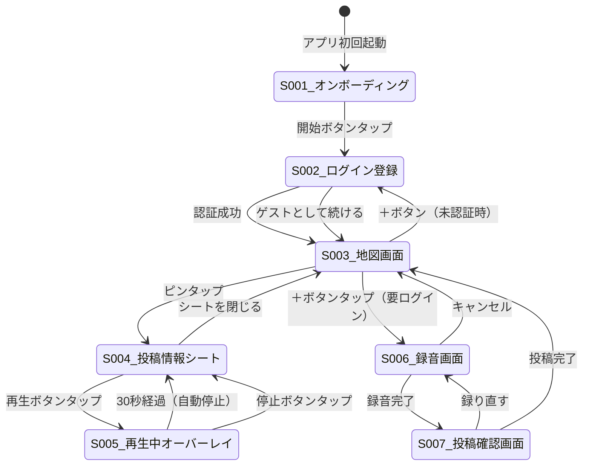
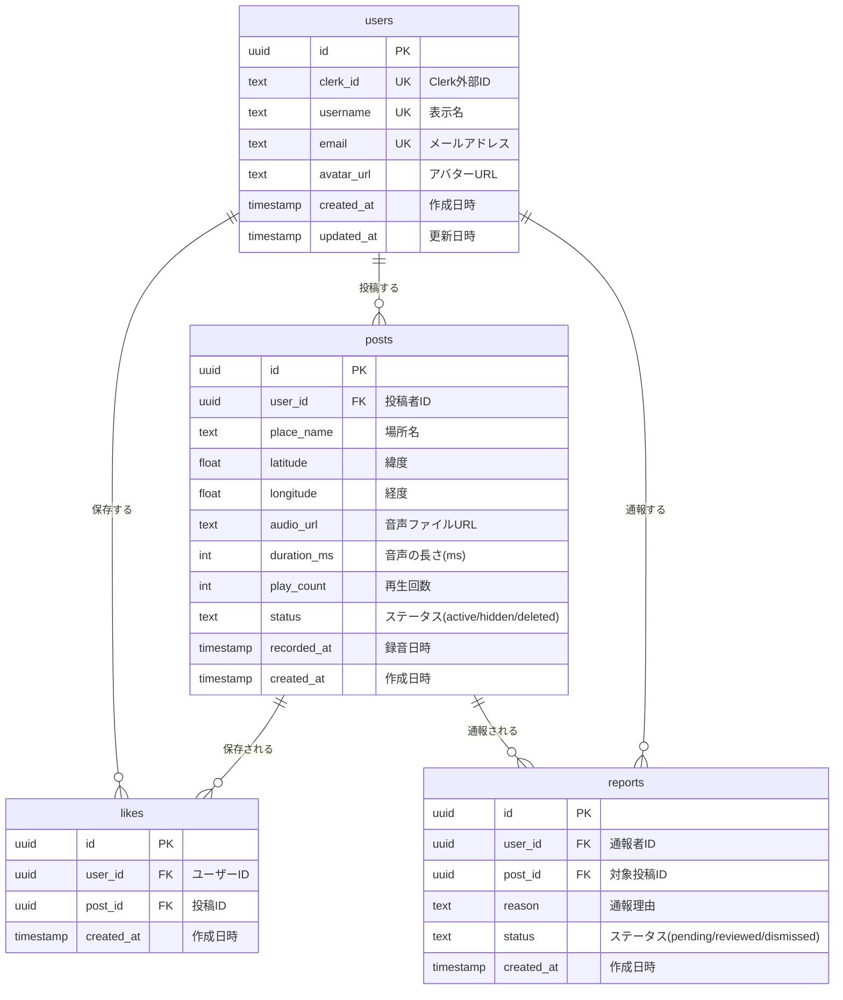
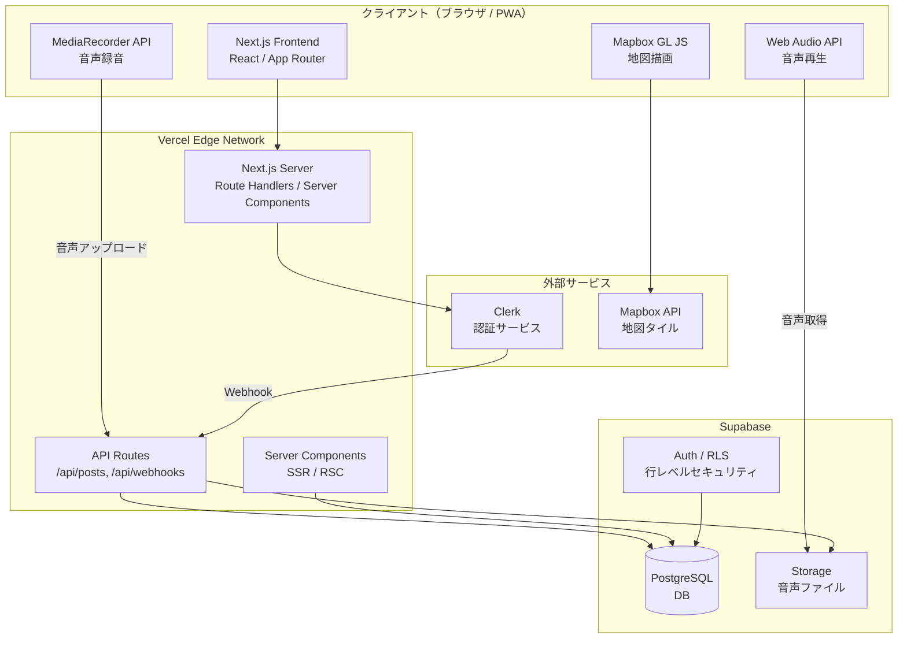
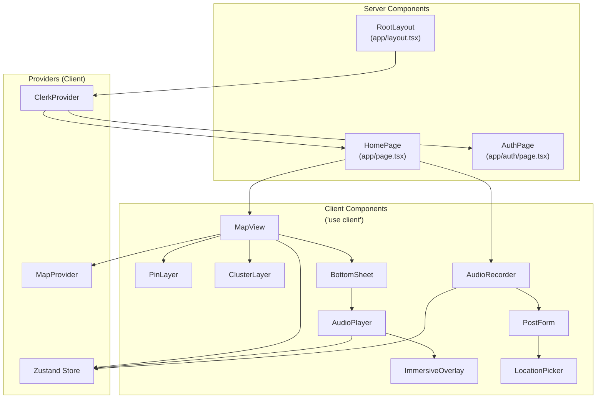

# 要件定義書 — SoundMap

## 1. プロジェクト概要

### 1.1 プロジェクト名

**「SoundMap — 音で旅する地図SNS 開発プロジェクト」**

### 1.2 背景・目的

- **背景**: 忙しい社会人は旅行に行きたくても時間がなく、日常ではSNSやショート動画に時間を浪費し、情報疲れを起こしている。視覚に頼る既存メディアが多く、「目を閉じてリラックスする余白」が日常に存在しない。一方で、ウェルネス・マインドフルネス市場は拡大しており、BeReal等の「引き算」のプロダクト設計やASMR・環境音コンテンツの人気が追い風となっている。SNS疲れが社会的に認知され、デジタルデトックスへの関心が高まる中、「地図 × 音声 × SNS」を組み合わせたサービスは市場に存在しない。
- **目的**:
  - 「音だけで旅行気分やリラックスを感じられるか」という仮説を検証する
  - ユーザーが自発的に環境音を録音・投稿するモチベーションがあるかを確認する
  - 寝る前の利用が習慣化するかを観察する
  - 定量目標: MVP公開後3ヶ月でアクティブユーザー100人、7日リテンション率15%以上

### 1.3 システムのビジョン / スコープ

- **ビジョン**: 世界中のリアルな環境音が地図上に蓄積され、誰でも「目を閉じて30秒、音で旅する」体験ができるプラットフォーム。投稿が増えるほど地図が豊かになるネットワーク効果により、特定の場所・季節・時間帯の音という希少なコンテンツが自然増殖するエコシステムを構築する。
- **スコープ（含む）**:
  - PWA（Progressive Web App）としてのWebアプリ実装
  - 世界地図表示、音声スポットのピン表示・クラスタリング
  - 30秒間の環境音再生（没入オーバーレイ付き）
  - 環境音の録音・位置情報付き投稿
  - ユーザー認証（メール / Google / Apple）
- **スコープ（含まない）**:
  - ネイティブアプリ（iOS / Android）の開発（将来検討）
  - いいね・保存機能、投稿履歴（Phase 2で対応）
  - エリアフィルター、人気スポット表示、プレミアム機能（Phase 3で対応）
  - 管理者ダッシュボード（MVP段階ではSupabase Dashboardで代用）

---

## 2. ビジネス要件

### 2.1 ビジネスモデル情報

#### リーンキャンバス要約

| 項目 | 内容 |
|------|------|
| **課題** | 旅行に行けない社会人の旅行願望が満たされない / SNS・ショート動画による情報疲れ・時間浪費 / 寝る前に視覚を使わないリフレッシュ手段がない |
| **顧客セグメント** | 20〜30代の旅行好き・音楽好きな社会人。SNS疲れを感じている人 |
| **独自の価値提案** | 目を閉じて30秒、誰かがその場で録った音で旅先の空気を感じる「余白の時間」 |
| **ソリューション** | 世界地図上で環境音を共有する音声特化型SNS。30秒固定で時間を浪費させない設計 |
| **チャネル** | App Store / Google Play（将来）、Twitter(X)での口コミ、旅行系インフルエンサー |
| **収益の流れ** | フリーミアム（基本無料 + プレミアムプラン: 高音質再生、オフライン保存、保存数無制限） |
| **コスト構造** | 音声ストレージ・配信コスト、サーバーインフラ、地図API利用料 |
| **主要指標** | DAU、1人あたり再生回数/セッション、投稿数増加率、リテンション率（翌日/7日/30日） |
| **圧倒的な優位性** | 投稿蓄積によるネットワーク効果 / 場所・季節・時間帯に紐づく音の希少性（再現不可能） |

#### 7Powers視点での優位性

| Power | 該当 | 説明 |
|-------|------|------|
| Network Effects | ○ | 投稿が蓄積されるほど地図上の音が充実し、聴く側の体験価値が向上→投稿者の投稿動機も上がる |
| Counter-Positioning | ○ | 既存SNS（TikTok, Instagram）は視覚情報・エンゲージメント最大化が前提。30秒固定・音声のみ・引き算設計はそれらの逆を行くため、模倣困難 |
| Cornered Resource | △ | 特定の場所・季節・時間帯の音は二度と録れない希少コンテンツ。蓄積されると代替困難 |
| Scale Economies | △ | 音声データの配信コストはスケールにより低減 |
| Switching Costs | △ | 保存した音のライブラリ、投稿履歴がロックインになりうる（Phase 2以降） |

#### 市場規模 / 成長予測（仮定）

- **グローバルウェルネスアプリ市場**: 2024年時点で約60億ドル、年間成長率15〜20%
- **日本国内の瞑想・マインドフルネスアプリユーザー**: 推定200〜300万人
- **SoundMapの初期TAM**: 旅行好き×SNS疲れを感じる20〜30代社会人 → 日本国内推定50〜100万人
- **SAM**: スマホで環境音・ASMR系コンテンツを日常的に聴くユーザー → 推定10〜20万人
- **SOM**: MVP段階の身近なコミュニティ → 100〜1,000人

### 2.2 成果指標（KPI/KGI）

#### KGI（最終目標）

| 指標 | 目標値 | 期限 |
|------|--------|------|
| アクティブユーザー数 | 100人 | MVP公開後3ヶ月 |
| 主要都市・観光地の音声カバレッジ | 主要10都市以上 | MVP公開後1年 |

#### KPI（先行指標）

| 指標 | 目標値 | 計測タイミング |
|------|--------|--------------|
| DAU（日次アクティブユーザー） | 初期ユーザーの30%以上 | 毎日 |
| 1ユーザーあたり再生回数/セッション | 3回以上 | 毎週 |
| 投稿数（音声スポット増加率） | 週10件以上 | 毎週 |
| 翌日リテンション率 | 40%以上 | MVP公開後1ヶ月 |
| 7日リテンション率 | 15%以上 | MVP公開後1ヶ月 |
| 30日リテンション率 | 10%以上 | MVP公開後3ヶ月 |
| 初期ユーザーの「また使いたい」回答率 | 50%以上 | MVP公開後1ヶ月 |

#### 撤退基準

- MVP公開後3ヶ月で7日リテンション率が10%を下回る場合
- 投稿数が自然増加せず、コンテンツ供給が止まる場合

### 2.3 ビジネス上の制約

- **予算**: スタートアップ初期段階。SaaS無料枠を最大限活用し、月額ランニングコスト$50以内（仮定）
- **開発期間**: MVPを4〜6週間で公開
- **リソース**: 少人数チーム（1〜3名）。フルスタック開発者が主導（仮定）
- **法的要件**: 個人情報保護法に準拠（位置情報の取り扱い）。利用規約・プライバシーポリシーの策定が必要

---

## 3. ユーザー要件

### 3.1 ユーザープロファイル / ペルソナ

#### ペルソナ1: 田中 翔太（メインペルソナ）

| 項目 | 内容 |
|------|------|
| **年齢・性別** | 28歳・男性 |
| **職業** | IT企業の営業職 |
| **生活環境** | 都内一人暮らし。平日は残業多め、休日は疲れて家にいることが多い |
| **利用デバイス** | iPhone（メイン）、会社PC |
| **課題** | 旅行好きだがまとまった休みが取れず年1〜2回。仕事終わりにショート動画で1時間以上消費し罪悪感。寝る前にスマホを見てしまい睡眠の質が悪い |
| **ゴール** | 短時間で完結するリラックス体験を得る。視覚を使わず、目を閉じて旅行気分を味わう |
| **利用シーン** | 22:00〜23:30、ベッドの中でイヤホンをつけて。暗い部屋で目を閉じて30秒の音を聴いてから眠りにつく |
| **情報収集** | Twitter(X)、App Storeランキング、友人の口コミ |

#### ペルソナ2: 佐藤 美咲（サブペルソナ）

| 項目 | 内容 |
|------|------|
| **年齢・性別** | 32歳・女性 |
| **職業** | メーカー勤務（経理） |
| **生活環境** | 結婚して郊外在住。旅行好きだがパートナーと休みが合わない |
| **課題** | 一人旅にも興味はあるが踏み出せない。「どこか遠くに行きたい」気持ちが常にある |
| **利用シーン** | 寝る前に「次の旅行先」を音で探索する感覚で使う。過去に行った場所の音を聴いて思い出に浸る |

#### 非ターゲット

- 旅行中のリアルタイム情報を求める人（ガイドアプリの領域）
- 音楽制作やフィールドレコーディングを専門的に行う人
- SNSでの発信・承認欲求を満たしたい人
- 10代のライトなSNSユーザー

### 3.2 ユーザーストーリー

| ID | ユーザーストーリー | 優先度 |
|----|-------------------|--------|
| US-001 | 旅行に行けない社会人として、寝る前に世界中の音を聴きたい。なぜなら、目を閉じて30秒の余白を得てリラックスしたいから。 | Must |
| US-002 | SoundMapユーザーとして、地図をスクロールして気になる場所のピンをタップしたい。なぜなら、「どんな音がするんだろう」というワクワク感で探索したいから。 | Must |
| US-003 | 旅先にいるユーザーとして、今聴こえている環境音を録音して共有したい。なぜなら、この場所の空気感を他の人にも届けたいから。 | Must |
| US-004 | 初めてのユーザーとして、できるだけ手軽にアカウント登録したい。なぜなら、寝る前の限られた時間でストレスなく始めたいから。 | Must |
| US-005 | リピートユーザーとして、気に入った音を保存しておきたい。なぜなら、また同じ音を聴いてリラックスしたいから。 | Should (Phase 2) |

### 3.3 MVP（Minimum Viable Product）の定義

- **MVPで実装する範囲**: コア体験の検証に必要な最小機能セット
  - 世界地図表示 + ピン表示（コア体験の土台）
  - 音声再生 30秒・自動停止（コア体験そのもの）
  - 投稿情報表示（場所名・投稿者名・日時）
  - 音声録音 30秒 + プレビュー再生 + 録り直し
  - 位置情報自動取得 + 場所名入力
  - ユーザー登録・ログイン（メール / Google / Apple）
- **MVPのゴール**: 早期リリースによるコア仮説の検証
  - 「音だけでリラックスできるか」「投稿するモチベーションがあるか」「習慣化するか」の3つを検証
  - 初期ユーザー（友人・知人）からのフィードバックを基にプロダクト方針を決定

---

## 4. 機能要件

### 4.1 機能一覧 / MoSCoW 分類

| 機能ID | 機能名 | 要約 | Must/Should/Could/Won't | MVP対象 |
|--------|--------|------|------------------------|---------|
| F-001 | メール登録 | メールアドレス＆パスワードでアカウント作成 | Must | Yes |
| F-002 | SNSログイン | Google / Apple アカウントでのログイン | Must | Yes |
| F-003 | ログアウト | セッション破棄とログアウト処理 | Must | Yes |
| F-004 | パスワードリセット | メール経由でのパスワード再設定 | Must | Yes |
| F-005 | 世界地図表示 | 世界地図を表示し、ズーム・スクロール操作が可能 | Must | Yes |
| F-006 | ピン表示 | 音声が投稿された場所にピンアイコンを表示 | Must | Yes |
| F-007 | ピンクラスタリング | 密集するピンをクラスタとしてまとめて表示 | Must | Yes |
| F-008 | 投稿情報表示 | ピンタップでボトムシートに場所名・投稿者名・録音日時を表示 | Must | Yes |
| F-009 | 30秒音声再生 | 再生ボタンタップで30秒の環境音を再生、自動停止 | Must | Yes |
| F-010 | 没入オーバーレイ | 再生中は画面を暗転させ、残り時間のみ控えめに表示 | Must | Yes |
| F-011 | 手動停止 | 再生中に停止ボタンで再生を中断可能 | Must | Yes |
| F-012 | 30秒録音 | スマホのマイクで環境音を最大30秒録音（自動停止） | Must | Yes |
| F-013 | プレビュー再生 | 投稿前に録音内容を再生確認 | Must | Yes |
| F-014 | 録り直し | 録音をやり直し可能 | Must | Yes |
| F-015 | 位置情報取得 | 録音時の位置情報を自動取得 | Must | Yes |
| F-016 | 位置情報手動設定 | 位置情報取得失敗時に地図上で手動選択 | Must | Yes |
| F-017 | 場所名入力 | 投稿に場所名をテキスト入力で付与 | Must | Yes |
| F-018 | 音声投稿 | 音声＋位置情報＋場所名をサーバーに送信・公開 | Must | Yes |
| F-019 | いいね（保存） | 気に入った音を保存リストに追加 | Should | No (Phase 2) |
| F-020 | 保存一覧 | 保存した音をリスト表示し再生可能 | Should | No (Phase 2) |
| F-021 | 投稿履歴 | 自分の投稿をリスト表示 | Should | No (Phase 2) |
| F-022 | 通報機能 | 不適切な音声を通報 | Should | No (Phase 2) |
| F-023 | コンテンツ審査 | 投稿された音声の確認 | Should | No (Phase 2) |
| F-024 | エリアフィルター | 国・地域でピンを絞り込み | Could | No (Phase 3) |
| F-025 | 人気スポット表示 | 再生数の多いピンをハイライト表示 | Could | No (Phase 3) |
| F-026 | 季節・時間帯タグ | 投稿に季節や時間帯のタグを付与 | Could | No (Phase 3) |
| F-027 | 高音質再生 | より高いビットレートでの音声再生 | Could | No (Phase 3) |
| F-028 | オフライン保存 | 保存した音をオフラインで再生可能 | Could | No (Phase 3) |
| F-029 | 保存数無制限 | 保存できる音の数の制限を解除 | Could | No (Phase 3) |

### 4.2 機能詳細仕様

#### 4.2.1 `F-001〜F-004: 認証機能`

- **概要**: ユーザーがメールアドレス＆パスワード、またはGoogle/Appleアカウントでアカウントを作成・ログインする
- **ユースケース**: 「新規ユーザーがSoundMapを初めて使うとき」「既存ユーザーが再度ログインするとき」
- **前提条件**: Clerkが導入されており、認証基盤として利用可能
- **正常系フロー（新規登録）**:
  1. ユーザーがアプリ（PWA）にアクセスする
  2. コンセプト紹介画面（1〜2枚）が表示される：「目を閉じて30秒、音で旅しよう」
  3. 「メールで登録」「Googleで続ける」「Appleで続ける」のボタンが表示される
  4. メール登録の場合: メールアドレスとパスワードを入力
  5. Clerkがバリデーション実行（メール形式、パスワード要件）
  6. 確認メールが送信される（Clerk Email Verification）
  7. メール内のリンクをクリックして認証完了
  8. 地図画面（ホーム）に自動遷移
- **正常系フロー（SNSログイン）**:
  1. 「Googleで続ける」or「Appleで続ける」をタップ
  2. OAuth認証画面に遷移
  3. 認証完了後、地図画面（ホーム）に遷移
- **例外系フロー**:
  - 既に登録済みのメールアドレスの場合 → 「このメールアドレスは既に登録されています。ログインしてください」と表示
  - パスワードが要件（8文字以上、英数字混在）を満たさない場合 → リアルタイムでエラー表示
  - ネットワークエラー → 「接続できません。ネットワークを確認してください」と表示
  - OAuth認証キャンセル → 登録画面に戻る
- **UI要件**:
  - ダークテーマに統一されたシンプルな登録画面
  - 入力エラー時はインラインでリアルタイム表示（フィールド下部に赤文字）
  - SNSログインボタンは視認性の高いサイズで配置（寝る前の操作を考慮）
  - 未認証ユーザーでも地図の閲覧・音声再生は可能（投稿時にログインを要求）
- **非機能面注意**:
  - HTTPS通信必須（Vercelで標準対応）
  - ClerkのJWTトークンによるセッション管理
  - Clerk Webhookで新規ユーザー情報をSupabaseのusersテーブルに同期

---

#### 4.2.2 `F-005〜F-011: 地図表示・音声再生機能`

- **概要**: 世界地図上に音声スポットのピンを表示し、ピンタップで30秒間の環境音を再生する
- **ユースケース**: 「寝る前のユーザーが地図を探索して気になる場所の音を聴く」
- **前提条件**: Mapbox GL JS（react-map-gl）が導入済み、音声ファイルがSupabase Storageに保存済み
- **正常系フロー**:
  1. ログイン後（または未認証で）地図画面が表示される
  2. 世界地図上に音声スポットのピンが表示される（密集エリアはクラスタ表示）
  3. ユーザーが地図をズーム・スクロールして気になるエリアを探索する
  4. ピンをタップする
  5. ボトムシートがスライドアップし、投稿情報が表示される
     - 場所名（例:「渋谷スクランブル交差点」）
     - 投稿者名（例:「@shota_t」）
     - 録音日時（例:「2026年3月15日 18:30」）
  6. 再生ボタン（▶）をタップ
  7. 没入オーバーレイが表示される（画面暗転、残り時間のみ表示）
  8. 軽いハプティクスフィードバックが発生
  9. 30秒間、環境音が再生される
  10. 30秒経過で自動停止、オーバーレイが閉じる
  11. ボトムシートに戻る（別のピンを聴くか、アプリを閉じる）
- **例外系フロー**:
  - 音声ファイルの読み込み失敗 → 「音声を読み込めませんでした。再試行してください」とボトムシート内に表示
  - ネットワーク切断中 → 「オフラインです」と控えめに表示
  - ユーザーが手動停止ボタンをタップ → 再生を即時中断し、オーバーレイを閉じる
  - ピンが0件の地域 → 地図は表示されるがピンがないことが視覚的にわかる（メッセージは不要）
- **UI要件**:
  - 地図はMapboxのダークテーマスタイル（`mapbox://styles/mapbox/dark-v11`）を使用
  - ピンのアイコン: 淡いブルーまたはアンバーの円形アイコン
  - ボトムシート: 画面下部から40%程度の高さでスライドアップ。半透明の暗い背景
  - 没入オーバーレイ: 背景`#0a0a0f` 95%透明度。中央に残り時間カウントダウン（控えめなフォントサイズ）。下部に停止ボタン（ミニマルな○アイコン）
  - 再生中のアニメーション: 音の波形を模した控えめなパルスアニメーション
- **非機能面注意**:
  - 地図の初期表示: 2秒以内
  - 音声再生開始: タップから1秒以内
  - 地図操作: 60fpsでスムーズに動作
  - ビューポート外のピンは遅延読み込み

---

#### 4.2.3 `F-012〜F-018: 録音・投稿機能`

- **概要**: スマホのマイクで環境音を30秒録音し、位置情報と場所名を付与して投稿する
- **ユースケース**: 「旅先にいるユーザーが、今聴こえている環境音を録音して共有する」
- **前提条件**: ユーザーがログイン済み。マイク権限と位置情報権限がブラウザに許可されている
- **正常系フロー**:
  1. 地図画面の投稿ボタン（＋ボタン、画面右下）をタップ
  2. 未ログインの場合 → ログイン画面に遷移
  3. マイク権限のリクエストダイアログが表示される（初回のみ）
  4. 録音画面に遷移（大きな録音ボタンが中央に配置）
  5. 録音ボタンをタップして録音開始
  6. タイマーが0:00から進行し、録音中のフィードバック（波形アニメーション）が表示される
  7. 30秒で自動停止（または手動停止ボタンで早期停止）
  8. 投稿確認画面に遷移:
     - プレビュー再生ボタン（録音内容を確認）
     - 「録り直す」ボタン → 録音画面に戻る
     - 場所名入力フィールド（テキスト）
     - 位置情報表示（自動取得された緯度・経度を住所表示）
     - 「投稿する」ボタン
  9. 「投稿する」をタップ
  10. 音声ファイルがSupabase Storageにアップロードされる
  11. メタデータ（位置情報、場所名、ユーザーID、日時）がSupabase DBに保存される
  12. 投稿完了のサクセスアニメーション（控えめ）
  13. 地図画面に戻り、新しいピンが表示される
- **例外系フロー**:
  - マイク権限が拒否された場合 → 「録音にはマイクの許可が必要です。設定から許可してください」と案内
  - 位置情報取得失敗 → 地図UIが表示され、手動でピンを置いて位置を選択するフォールバック（F-016）
  - アップロード失敗（ネットワークエラー） → 「投稿できませんでした。再試行してください」と表示。音声はローカルに一時保存
  - 録音中にアプリがバックグラウンドに移行 → 録音を停止し、それまでの録音内容を保持
- **UI要件**:
  - 録音ボタン: 大きな円形ボタン（アクセントカラー）。録音中は赤く点滅
  - タイマー: 録音中は中央上部に大きく表示（例: 「0:15 / 0:30」）
  - 波形アニメーション: 録音中のフィードバックとしてリアルタイム波形を表示
  - 場所名入力: プレースホルダー「どこで録りましたか？」
  - 位置情報表示: ミニマップ + テキスト住所（タップで手動修正可能）
- **非機能面注意**:
  - 録音フォーマット: WebM（Opus）を第一優先。非対応ブラウザではMP4（AAC）にフォールバック
  - 録音ビットレート: 128kbps（ファイルサイズ約500KB/30秒）
  - アップロード: 録音終了から投稿完了まで5秒以内
  - MediaRecorder APIを使用。iOSの互換性に注意（テスト必須）

---

## 5. UI/UX設計

### 5.1 デザインコンセプト

「**静寂の中の探索**」— 暗い部屋でベッドに横たわり、目を閉じる直前に触れるアプリ。余計な情報を削ぎ落とし、「音」と「地図」だけが主役になる没入型UI。

| 項目 | 方針 |
|------|------|
| テーマ | ダーク・ミニマル・没入型 |
| トーン＆マナー | 静謐で上品。主張しすぎないタイポグラフィ |
| 避けるべき要素 | 通知バッジ、数字の強調表示、無限スクロール、自動再生の連続 |
| アニメーション | 控えめ。フェード遷移、ボトムシートのスライドアップ程度 |
| フィードバック | 再生開始時の軽いハプティクス、投稿完了時の控えめなサクセス演出 |

### 5.2 カラーパレット

| 用途 | カラー | HEXコード |
|------|--------|-----------|
| 背景（プライマリ） | ディープブラック | `#0a0a0f` |
| 背景（セカンダリ） | ダークグレー | `#121212` |
| サーフェス（カード・シート） | ダークネイビー | `#1a1a2e` |
| サーフェス（ホバー） | ネイビー | `#16213e` |
| アクセント（プライマリ） | ソフトブルー | `#5B8DEF` |
| アクセント（セカンダリ） | アンバー | `#E8A838` |
| テキスト（プライマリ） | オフホワイト | `#e0e0e0` |
| テキスト（セカンダリ） | グレー | `#888888` |
| テキスト（非アクティブ） | ダークグレー | `#555555` |
| エラー | ソフトレッド | `#EF5B5B` |
| 成功 | ソフトグリーン | `#5BEF8D` |

### 5.3 タイポグラフィ

| 用途 | フォント | サイズ | ウェイト |
|------|----------|--------|----------|
| 見出し（H1） | Inter / Noto Sans JP | 24px | 300 (Light) |
| 見出し（H2） | Inter / Noto Sans JP | 20px | 400 (Regular) |
| 本文 | Inter / Noto Sans JP | 14px | 400 (Regular) |
| キャプション | Inter / Noto Sans JP | 12px | 400 (Regular) |
| ボタン | Inter / Noto Sans JP | 16px | 500 (Medium) |
| 残り時間表示 | Inter (monospace) | 48px | 200 (Extra Light) |

### 5.4 画面一覧

| 画面ID | 画面名 | 目的 | フェーズ |
|--------|--------|------|----------|
| S-001 | オンボーディング | コンセプト紹介（1〜2枚） | MVP |
| S-002 | ログイン / 登録 | アカウント認証 | MVP |
| S-003 | 地図画面（ホーム） | 音を探して聴くメイン画面 | MVP |
| S-004 | 投稿情報ボトムシート | 音の詳細確認・再生開始 | MVP |
| S-005 | 再生中オーバーレイ | 30秒の没入体験 | MVP |
| S-006 | 録音画面 | 環境音を録音 | MVP |
| S-007 | 投稿確認画面 | 録音内容の確認・場所名入力・投稿 | MVP |
| S-008 | 保存一覧画面 | 保存した音をリスト表示 | Phase 2 |
| S-009 | 投稿履歴画面 | 自分の投稿をリスト表示 | Phase 2 |
| S-010 | プロフィール画面 | ユーザー情報・設定 | Phase 2 |

### 5.5 画面遷移図



### 5.6 ワイヤーフレーム（テキストベース）

#### S-003: 地図画面（ホーム）

```
┌─────────────────────────────────┐
│  SoundMap              [👤]     │ ← ヘッダー（ロゴ + プロフィールアイコン）
├─────────────────────────────────┤
│                                 │
│                                 │
│         ┌─[📍]──┐              │
│         │       │              │
│    [📍] │  MAP  │    [📍]     │ ← 世界地図（Mapbox Dark）
│         │       │              │    ピン = 音声スポット
│    [📍📍] └───────┘   [📍]     │    クラスタ表示
│                                 │
│                                 │
│                                 │
│                         [＋]    │ ← 投稿ボタン（FAB, 右下）
└─────────────────────────────────┘
```

#### S-004 + S-005: 投稿情報ボトムシート + 再生中オーバーレイ

```
【ボトムシート（ピンタップ時）】          【再生中オーバーレイ】
┌─────────────────────────────────┐    ┌─────────────────────────────────┐
│         MAP (背景)              │    │                                 │
│                                 │    │                                 │
│                                 │    │                                 │
├─────────────────────────────────┤    │          0:18                   │ ← 残り時間
│  ─── (ドラッグハンドル)         │    │                                 │    （控えめ表示）
│                                 │    │     ～～～～～～～～            │ ← 波形アニメ
│  📍 渋谷スクランブル交差点      │    │                                 │
│  @shota_t ・ 2026/03/15 18:30  │    │                                 │
│                                 │    │                                 │
│       [ ▶ 再生する ]           │    │          [ ⏹ ]                 │ ← 停止ボタン
│                                 │    │                                 │
└─────────────────────────────────┘    └─────────────────────────────────┘
```

#### S-006 + S-007: 録音画面 + 投稿確認画面

```
【録音画面】                            【投稿確認画面】
┌─────────────────────────────────┐    ┌─────────────────────────────────┐
│  ← 戻る          録音           │    │  ← 戻る       投稿確認         │
├─────────────────────────────────┤    ├─────────────────────────────────┤
│                                 │    │                                 │
│                                 │    │  ▶ プレビュー再生   0:30      │
│         0:15 / 0:30             │    │  ───────────●────────          │
│                                 │    │                                 │
│     ～～～～～～～～～～        │    │  📍 位置情報                   │
│     （リアルタイム波形）        │    │  東京都渋谷区... [地図で修正]  │
│                                 │    │                                 │
│                                 │    │  場所名                        │
│                                 │    │  ┌─────────────────────────┐  │
│          [  🔴  ]               │    │  │ どこで録りましたか？     │  │
│       （録音 / 停止ボタン）     │    │  └─────────────────────────┘  │
│                                 │    │                                 │
│                                 │    │  [録り直す]   [投稿する ✓]    │
└─────────────────────────────────┘    └─────────────────────────────────┘
```

---

## 6. 非機能要件

### 6.1 パフォーマンス要件

| 項目 | 要件 | 根拠 |
|------|------|------|
| 地図の初期表示 | 2秒以内 | 寝る前の利用シーンでは待ち時間が離脱に直結 |
| 音声再生開始 | タップから1秒以内 | コア体験の即時性を担保 |
| 投稿完了 | 録音終了から5秒以内 | 投稿のストレスを最小化 |
| 地図操作 | 60fpsでスムーズに動作 | 探索体験の質を担保 |
| 同時接続ユーザー | MVP: 50人、拡大期: 5,000人 | 初期100ユーザーのDAU率50%、拡大期は数万ユーザーのDAU率25%を想定 |
| 1日あたりリクエスト数 | MVP: 5,000、拡大期: 100,000 | 音声再生・地図タイル取得を含む（仮定） |

### 6.2 セキュリティ要件

| 項目 | 要件 |
|------|------|
| 認証/認可 | ClerkによるJWTトークンベースのセッション管理。SupabaseのRow Level Security（RLS）でデータアクセスを制御 |
| データ保護 | 全通信をHTTPS（TLS 1.3）で暗号化。Vercelで標準対応 |
| 音声データ保護 | Supabase Storageの認証付きURLでアクセス制御 |
| 個人情報 | 位置情報は投稿時のみ取得。ユーザーの現在地をリアルタイム追跡しない。プライバシーポリシーで明示 |
| 不正投稿対策 | MVP段階は手動レビュー。Phase 2で通報機能。将来的にAI音声分類を検討 |
| コンプライアンス | 個人情報保護法に準拠。GDPR対応は海外展開時に検討 |

### 6.3 可用性・信頼性

| 項目 | 要件 |
|------|------|
| 稼働率 | 99.5%以上 |
| 計画メンテナンス | 日本時間 平日10:00〜14:00に実施（利用ピーク22:00〜0:00を避ける） |
| バックアップ | Supabaseの自動バックアップ（日次）。音声ファイルはSupabase Storageの冗長性に依存 |
| 障害復旧 | Vercel/Supabaseのマネージドサービスに依存。RTO: 4時間以内（仮定） |

### 6.4 ユーザビリティ / UI・UX

| 項目 | 要件 |
|------|------|
| 操作ステップ | コア体験は3ステップ以内（開く→タップ→聴く） |
| ダークUI | 全画面ダークテーマを標準 |
| レスポンシブ | モバイルファースト。タブレット・PCにも対応 |
| アクセシビリティ | WCAG 2.1 AA準拠を目指す |
| 多言語対応 | 初期は日本語のみ（仮定）。i18n対応の設計は行う |

### 6.5 スケーラビリティ

| 項目 | 要件 |
|------|------|
| MVP段階 | 数百ユーザー、数千件の音声データに対応 |
| 拡大期 | 数万ユーザー規模の音声配信に対応 |
| 音声ストレージ | 1件あたり約500KB。1万件で約5GB |
| 水平スケーリング | VercelのEdge Network + Supabaseの自動スケーリングに依存 |
| キャッシュ戦略 | 音声ファイルのCDNキャッシュ。地図タイルのブラウザキャッシュ |

---

## 7. データベース設計

### 7.1 ER図



### 7.2 テーブル定義

#### `users` テーブル

| カラム名 | データ型 | 制約 | 説明 |
|----------|----------|------|------|
| id | UUID | PK, DEFAULT gen_random_uuid() | ユーザーID |
| clerk_id | TEXT | UNIQUE, NOT NULL | ClerkのユーザーID |
| username | TEXT | UNIQUE, NOT NULL | 表示名（3〜20文字） |
| email | TEXT | UNIQUE, NOT NULL | メールアドレス |
| avatar_url | TEXT | NULLABLE | アバター画像URL |
| created_at | TIMESTAMPTZ | NOT NULL, DEFAULT now() | 作成日時 |
| updated_at | TIMESTAMPTZ | NOT NULL, DEFAULT now() | 更新日時 |

**インデックス**: `clerk_id` (UNIQUE), `username` (UNIQUE)
**RLS**: ユーザーは自分のレコードのみ更新可能。全ユーザーのusername/avatar_urlは読み取り可能。

#### `posts` テーブル

| カラム名 | データ型 | 制約 | 説明 |
|----------|----------|------|------|
| id | UUID | PK, DEFAULT gen_random_uuid() | 投稿ID |
| user_id | UUID | FK → users.id, NOT NULL | 投稿者のユーザーID |
| place_name | TEXT | NOT NULL | 場所名（1〜100文字） |
| latitude | DOUBLE PRECISION | NOT NULL | 緯度（-90〜90） |
| longitude | DOUBLE PRECISION | NOT NULL | 経度（-180〜180） |
| audio_url | TEXT | NOT NULL | Supabase StorageのファイルパスまたはURL |
| duration_ms | INTEGER | NOT NULL, DEFAULT 30000 | 音声の長さ（ミリ秒） |
| play_count | INTEGER | NOT NULL, DEFAULT 0 | 再生回数 |
| status | TEXT | NOT NULL, DEFAULT 'active' | ステータス（active / hidden / deleted） |
| recorded_at | TIMESTAMPTZ | NOT NULL | 録音日時 |
| created_at | TIMESTAMPTZ | NOT NULL, DEFAULT now() | 投稿日時 |

**インデックス**: `user_id`, `(latitude, longitude)`（地理空間クエリ用）, `status`
**RLS**: 全ユーザーがstatusが'active'の投稿を読み取り可能。投稿者のみ自分の投稿を更新・削除可能。

#### `likes` テーブル（Phase 2）

| カラム名 | データ型 | 制約 | 説明 |
|----------|----------|------|------|
| id | UUID | PK, DEFAULT gen_random_uuid() | いいねID |
| user_id | UUID | FK → users.id, NOT NULL | いいねしたユーザーID |
| post_id | UUID | FK → posts.id, NOT NULL | いいねされた投稿ID |
| created_at | TIMESTAMPTZ | NOT NULL, DEFAULT now() | いいね日時 |

**制約**: UNIQUE (user_id, post_id) — 同じ投稿に対する重複いいねを防止
**RLS**: ユーザーは自分のいいねのみ作成・削除可能。

#### `reports` テーブル（Phase 2）

| カラム名 | データ型 | 制約 | 説明 |
|----------|----------|------|------|
| id | UUID | PK, DEFAULT gen_random_uuid() | 通報ID |
| user_id | UUID | FK → users.id, NOT NULL | 通報者のユーザーID |
| post_id | UUID | FK → posts.id, NOT NULL | 通報対象の投稿ID |
| reason | TEXT | NOT NULL | 通報理由 |
| status | TEXT | NOT NULL, DEFAULT 'pending' | ステータス（pending / reviewed / dismissed） |
| created_at | TIMESTAMPTZ | NOT NULL, DEFAULT now() | 通報日時 |

**RLS**: ユーザーは自分の通報のみ作成可能。通報の閲覧・更新は管理者のみ。

---

## 8. インテグレーション要件

### 8.1 外部サービス / SaaS 連携

| サービス | 用途 | 料金（MVP段階） |
|----------|------|----------------|
| **Clerk** | ユーザー認証（メール / Google / Apple） | 無料枠: MAU 10,000まで |
| **Supabase** | PostgreSQL DB + Storage + Realtime | 無料枠: 500MB DB, 1GB Storage, 50,000 API requests/月 |
| **Mapbox** | 世界地図の表示、ダークテーマスタイル | 無料枠: 50,000 map loads/月 |
| **Vercel** | ホスティング・CDN・Edge Functions | 無料枠: 100GB bandwidth/月 |
| **GitHub** | ソースコード管理、CI/CD | 無料 |

### 8.2 API仕様

全APIはNext.js App RouterのRoute Handlers（`app/api/`）で実装。レスポンスはJSON形式。認証はClerkのJWTトークンをAuthorizationヘッダーで送信。

#### `GET /api/posts` — 音声投稿の一覧取得

地図のビューポートに表示すべき投稿を取得する。

- **認証**: 不要（未認証でも閲覧可能）
- **クエリパラメータ**:

| パラメータ | 型 | 必須 | 説明 |
|-----------|-----|------|------|
| north | number | Yes | ビューポート北端の緯度 |
| south | number | Yes | ビューポート南端の緯度 |
| east | number | Yes | ビューポート東端の経度 |
| west | number | Yes | ビューポート西端の経度 |
| limit | number | No | 取得件数上限（デフォルト: 100） |

- **レスポンス（200 OK）**:

```json
{
  "posts": [
    {
      "id": "550e8400-e29b-41d4-a716-446655440000",
      "place_name": "渋谷スクランブル交差点",
      "latitude": 35.6595,
      "longitude": 139.7004,
      "audio_url": "https://xxx.supabase.co/storage/v1/object/public/audio/...",
      "duration_ms": 30000,
      "play_count": 42,
      "recorded_at": "2026-03-15T18:30:00Z",
      "created_at": "2026-03-15T18:35:00Z",
      "user": {
        "id": "user-uuid",
        "username": "shota_t",
        "avatar_url": null
      }
    }
  ],
  "total": 1
}
```

- **エラーレスポンス（400 Bad Request）**:

```json
{
  "error": "Missing required query parameters: north, south, east, west"
}
```

---

#### `GET /api/posts/:id` — 音声投稿の詳細取得

特定の投稿の詳細情報を取得する。

- **認証**: 不要
- **パスパラメータ**: `id` — 投稿のUUID
- **レスポンス（200 OK）**:

```json
{
  "id": "550e8400-e29b-41d4-a716-446655440000",
  "place_name": "渋谷スクランブル交差点",
  "latitude": 35.6595,
  "longitude": 139.7004,
  "audio_url": "https://xxx.supabase.co/storage/v1/object/public/audio/...",
  "duration_ms": 30000,
  "play_count": 42,
  "recorded_at": "2026-03-15T18:30:00Z",
  "created_at": "2026-03-15T18:35:00Z",
  "user": {
    "id": "user-uuid",
    "username": "shota_t",
    "avatar_url": null
  }
}
```

- **エラーレスポンス（404 Not Found）**:

```json
{
  "error": "Post not found"
}
```

---

#### `POST /api/posts` — 音声投稿の作成

新しい音声投稿を作成する。音声ファイルはmultipart/form-dataで送信。

- **認証**: 必須（Clerk JWT）
- **Content-Type**: `multipart/form-data`
- **リクエストボディ**:

| フィールド | 型 | 必須 | 説明 |
|-----------|-----|------|------|
| audio | File | Yes | 音声ファイル（WebM or MP4, 最大2MB） |
| place_name | string | Yes | 場所名（1〜100文字） |
| latitude | number | Yes | 緯度（-90〜90） |
| longitude | number | Yes | 経度（-180〜180） |
| recorded_at | string (ISO 8601) | Yes | 録音日時 |

- **レスポンス（201 Created）**:

```json
{
  "id": "new-post-uuid",
  "place_name": "鎌倉 由比ヶ浜",
  "latitude": 35.3101,
  "longitude": 139.5445,
  "audio_url": "https://xxx.supabase.co/storage/v1/object/public/audio/...",
  "duration_ms": 30000,
  "play_count": 0,
  "recorded_at": "2026-04-01T16:00:00Z",
  "created_at": "2026-04-01T16:00:05Z"
}
```

- **エラーレスポンス（400 Bad Request）**:

```json
{
  "error": "Invalid audio file format. Supported: webm, mp4"
}
```

- **エラーレスポンス（401 Unauthorized）**:

```json
{
  "error": "Authentication required"
}
```

---

#### `PATCH /api/posts/:id/play` — 再生回数のインクリメント

音声再生完了時に再生回数をインクリメントする。

- **認証**: 不要
- **パスパラメータ**: `id` — 投稿のUUID
- **レスポンス（200 OK）**:

```json
{
  "play_count": 43
}
```

---

#### `POST /api/webhooks/clerk` — Clerk Webhookエンドポイント

Clerkからのユーザー作成/更新イベントを受信し、Supabaseのusersテーブルに同期する。

- **認証**: Clerk Webhook署名検証
- **イベント**: `user.created`, `user.updated`, `user.deleted`
- **処理**:
  - `user.created`: usersテーブルにレコードを挿入
  - `user.updated`: usersテーブルの該当レコードを更新
  - `user.deleted`: usersテーブルの該当レコードを論理削除

### 8.3 データ連携要件

| 項目 | 方針 |
|------|------|
| データ形式 | JSON（API通信）、multipart/form-data（ファイルアップロード） |
| 通信頻度 | リアルタイム（ユーザー操作起因） |
| リトライ制御 | 音声アップロード失敗時はクライアント側で最大3回リトライ。エクスポネンシャルバックオフ |
| Realtime | Supabase Realtimeで新規投稿をサブスクライブし、地図に即時反映（将来検討） |

---

## 9. 技術選定とアーキテクチャ

### 9.1 技術スタックの要約

| レイヤー | 技術 | バージョン |
|----------|------|-----------|
| フロントエンド | Next.js (React) | 16以降 |
| 言語 | TypeScript | 5.x |
| バックエンド | Next.js App Router (Route Handlers / Server Actions) | — |
| データベース | Supabase (PostgreSQL) | — |
| 認証 | Clerk | — |
| ホスティング / デプロイ | Vercel | — |
| 地図 | Mapbox GL JS (react-map-gl) | — |
| 音声処理 | Web Audio API / MediaRecorder API | — |
| ストレージ | Supabase Storage | — |
| スタイリング | Tailwind CSS | 4.x |
| 状態管理 | Zustand | — |
| UIコンポーネント | shadcn/ui | — |

### 9.2 アーキテクチャ概要図



### 9.3 コンポーネント階層図



### 9.4 主要コンポーネント仕様

#### `MapView` コンポーネント

- **区分**: Client Component（`'use client'`）
- **責務**: Mapbox GL JSの地図を描画し、ピンの表示・インタラクションを管理
- **Props**:

```typescript
interface MapViewProps {
  initialCenter?: { lat: number; lng: number };
  initialZoom?: number;
}
```

- **状態管理**: Zustandストアで以下を管理
  - `viewState`: 地図のビューステート（center, zoom, bounds）
  - `selectedPostId`: 選択中のピンの投稿ID（null = 未選択）
  - `posts`: ビューポート内の投稿データ配列
- **主要なロジック**:
  - ビューポート変更時に`/api/posts`をデバウンス付きで呼び出し、ピンデータを取得
  - `react-map-gl`の`Map`コンポーネントをラップ
  - ピンクラスタリングはMapboxの`supercluster`で処理

#### `AudioPlayer` コンポーネント

- **区分**: Client Component（`'use client'`）
- **責務**: 30秒間の音声再生と没入オーバーレイの表示制御
- **Props**:

```typescript
interface AudioPlayerProps {
  audioUrl: string;
  postId: string;
  placeName: string;
  onClose: () => void;
}
```

- **状態管理**: `useState`で以下をローカル管理
  - `isPlaying: boolean` — 再生中かどうか
  - `remainingSeconds: number` — 残り秒数
  - `showOverlay: boolean` — 没入オーバーレイの表示
- **主要なロジック**:
  - `HTMLAudioElement`で音声を再生。`useRef`でAudio要素を保持
  - `useEffect`で1秒ごとのカウントダウンタイマー
  - 30秒経過で自動停止→`PATCH /api/posts/:id/play`で再生回数をインクリメント
  - `navigator.vibrate(50)`でハプティクスフィードバック（対応端末のみ）

#### `AudioRecorder` コンポーネント

- **区分**: Client Component（`'use client'`）
- **責務**: MediaRecorder APIを使用した30秒間の音声録音
- **Props**:

```typescript
interface AudioRecorderProps {
  onRecordingComplete: (audioBlob: Blob, durationMs: number) => void;
  onCancel: () => void;
}
```

- **状態管理**: `useState`で以下をローカル管理
  - `recordingState: 'idle' | 'recording' | 'recorded'` — 録音の状態
  - `elapsedSeconds: number` — 経過秒数
  - `audioBlob: Blob | null` — 録音された音声データ
- **主要なロジック**:
  - `navigator.mediaDevices.getUserMedia({ audio: true })`でマイクアクセスを取得
  - `MediaRecorder`で録音。`mimeType`は`audio/webm;codecs=opus`を優先、非対応時は`audio/mp4`にフォールバック
  - 30秒で`mediaRecorder.stop()`を自動呼び出し
  - 録音データは`Blob`として保持し、プレビュー再生・投稿に使用

---

## 10. 開発プロセス / スケジュール

### 10.1 開発モデル・プロセス

**アジャイル / イテレーティブ**: MVP → ユーザーフィードバック → 改善のサイクルを高速に回す。

- 1週間スプリント
- 各スプリント終了時にデモ・レビュー
- ユーザーフィードバックを基にバックログを随時調整

### 10.2 スケジュール

| フェーズ | 期間 | 主なタスク |
|----------|------|-----------|
| 要件定義・設計 | Week 0 | 要件定義書の確定、Supabaseスキーマ設計、Figmaモック作成 |
| 基盤構築 | Week 1-2 | プロジェクトセットアップ（Next.js + Tailwind + shadcn/ui）、Clerk認証実装、Supabase接続・マイグレーション |
| 地図・再生機能 | Week 2-3 | Mapbox地図表示、ピン表示・クラスタリング、ボトムシートUI、30秒音声再生、没入オーバーレイ |
| 録音・投稿機能 | Week 3-4 | 録音UI、MediaRecorder実装、プレビュー再生、位置情報取得、投稿API、音声アップロード |
| 統合・UI仕上げ | Week 5 | 画面遷移統合、ダークUI仕上げ、レスポンシブ対応、PWA設定（manifest.json、Service Worker） |
| テスト・デプロイ | Week 6 | E2Eテスト、パフォーマンス検証、iOS Safari互換テスト、シード投稿50件作成、本番デプロイ |
| 検証・フィードバック | Week 7-8 | 初期ユーザーへの公開、フィードバック収集、KPI計測、Phase 2計画 |

---

## 11. リスクと課題

### 11.1 リスク一覧

| No | カテゴリ | リスク内容 | 影響度 | 発生確率 | 対応策 |
|----|---------|-----------|--------|----------|--------|
| R1 | 技術 | iOSのPWA録音制約（MediaRecorder API非対応/制限） | 高 | 中 | Week 1でiOS Safari検証を最優先実施。制約がある場合はCapacitor導入を検討 |
| R2 | 技術 | 地図パフォーマンス劣化（ピン増加時） | 中 | 高 | ピンクラスタリング、ビューポート内のみデータ取得、遅延読み込み |
| R3 | 技術 | ブラウザ間の音声フォーマット非互換 | 低 | 中 | WebM/MP4の自動判定。将来的にサーバーサイド変換を検討 |
| R4 | ビジネス | コールドスタート問題（地図上のピンがスカスカ） | 高 | 高 | 運営が50〜100件のシード投稿を用意。主要都市・観光地をカバー |
| R5 | ビジネス | 投稿モチベーション不足 | 高 | 中 | Phase 2で投稿数バッジ、再生回数表示を追加。投稿体験の楽しさを磨く |
| R6 | ビジネス | 30秒体験が物足りない/長すぎる | 中 | 中 | ユーザーテストで満足度を計測。秒数のA/Bテストを検討 |
| R7 | 法務 | 著作権侵害の音声投稿（音楽等） | 中 | 中 | 利用規約で環境音のみの投稿を明記。将来的に音楽検出API導入 |
| R8 | 法務 | 位置情報の個人情報保護 | 高 | 低 | 投稿時のみ取得。プライバシーポリシーで明示。個人情報保護法準拠 |
| R9 | 運用 | 少人数チームでの運用負荷 | 中 | 高 | 手動レビューを最小限に。Supabase Dashboardで運用 |
| R10 | 技術 | SaaS（Clerk/Supabase/Mapbox）の仕様変更・障害 | 高 | 低 | 代替サービスの事前調査。APIバージョン固定 |

### 11.2 課題 / 前提条件

- 開発チームのスキルセット（Next.js / React / TypeScript経験）が未確認（仮定: 経験あり）
- PWA vs ネイティブアプリの最終判断が未決定（仮定: PWAで進行）
- シード投稿の調達方法・担当者が未確定
- 利用規約・プライバシーポリシーの策定が未着手
- 地図APIの予算上限が未確定（仮定: Mapbox無料枠内で運用）

---

## 12. ランニング費用と運用方針

### 12.1 ランニング費用の目安

#### MVP段階（〜数百ユーザー）

| サービス | プラン | 月額費用 | 備考 |
|----------|--------|----------|------|
| Vercel | Hobby（無料） | $0 | 個人プロジェクト。100GB bandwidth/月 |
| Supabase | Free | $0 | 500MB DB, 1GB Storage, 50K requests/月 |
| Clerk | Free | $0 | MAU 10,000まで |
| Mapbox | Free tier | $0 | 50,000 map loads/月 |
| GitHub | Free | $0 | パブリック/プライベートリポジトリ |
| ドメイン | — | 約$12/年 | カスタムドメイン（仮定） |
| **合計** | | **$0〜1/月** | 無料枠内で運用可能 |

#### 拡大期（数千〜数万ユーザー）

| サービス | プラン | 月額費用 | 備考 |
|----------|--------|----------|------|
| Vercel | Pro | $20/月 | チーム利用、1TB bandwidth/月 |
| Supabase | Pro | $25/月 | 8GB DB, 100GB Storage |
| Clerk | Pro | $25/月〜 | MAU超過分は従量課金 |
| Mapbox | 従量課金 | $0〜50/月 | 50K超過分のmap loads |
| **合計** | | **$70〜120/月** | （仮定） |

### 12.2 運用・保守体制

| 項目 | 方針 |
|------|------|
| 運用チーム | 1〜2名（開発者が兼務）（仮定） |
| 監視 | Vercel Analytics（パフォーマンス）、Supabase Dashboard（DB/Storage使用量） |
| エラー監視 | Sentry（無料枠）でフロントエンドエラーを監視 |
| コンテンツ審査 | MVP段階は手動レビュー（Supabase Dashboardで確認）。Phase 2で通報機能を追加 |
| アップデート頻度 | 週1回程度のデプロイ（Vercel自動デプロイ） |
| バックアップ | Supabaseの自動日次バックアップ |

---

## 13. 変更管理

- **要件変更の合意プロセス**: GitHub Issueで変更要望を管理。影響度を評価し、優先度を再設定
- **バージョン管理**: GitHub（main / develop / feature ブランチ戦略）
- **Pull Request**: 全変更はPR経由。レビュー後にマージ
- **要件トレース**: この要件定義書はGitHubリポジトリで管理し、変更履歴を追跡

---

## 14. 参考資料 / 関連ドキュメント

| ドキュメント | パス | 説明 |
|-------------|------|------|
| システム要件定義書 | `docs/output/system_requirements.md` | 本書の入力となるシステム要件 |
| ビジネス要件 | `docs/input/business-requirements.md` | 課題定義・市場環境・ビジネスモデル |
| プロダクト要件 | `docs/input/product-requirements.md` | コアバリュー・機能・非機能要件 |
| ターゲットユーザー | `docs/input/user-personas.md` | ペルソナ・非ターゲット定義 |
| ユーザーフロー | `docs/input/user-flows.md` | 画面遷移・操作フロー |
| 機能一覧 | `docs/input/feature-list.md` | 全機能の優先度付きリスト |
| MVP範囲 | `docs/input/mvp-scope.md` | MVPスコープ・タイムライン |
| UI/UX方針 | `docs/input/ui-ux-direction.md` | デザインコンセプト・カラー・画面構成 |
| Clerk公式ドキュメント | https://clerk.com/docs | 認証サービスのドキュメント |
| Supabase公式ドキュメント | https://supabase.com/docs | DB・Storage・Realtimeのドキュメント |
| Mapbox GL JS | https://docs.mapbox.com/mapbox-gl-js/ | 地図ライブラリのドキュメント |
| Next.js App Router | https://nextjs.org/docs/app | フレームワークのドキュメント |

---

> **補足**:
>
> - 本書はアジャイル開発を前提としており、MVP リリース後にユーザーフィードバックを基に随時更新します。
> - `(仮定)` と明記した箇所は、情報が確定次第更新してください。
> - Mermaid図はGitHubやCursor等のMarkdownプレビューで描画可能です。
